# **Treinamentos  Kubernetes**

# Sumário


# **1 - Treinamentos**

Colocar ✔ quando concluído. 

## **1.1 - Linux Foundation** 

https://learning.edx.org/course/course-v1:LinuxFoundationX+LFS158x+3T2020/home✔


## **1.2 - Curso de Introdução ao Kubernetes**

https://docs.google.com/presentation/d/1weqpBWa9FNjKc1ugCUIpwYYquvoIOFbUvEcZ9ZYapAg/edit#slide=id.g23786ddafa_0_68

- Apresentação https://www.youtube.com/watch?v=RuNTvYejG90&feature=youtu.be ✔ 
- 01 - Revisão docker - https://www.youtube.com/watch?v=bcRArpK00OU&feature=youtu.be ✔ 
- 02 - O que é Kubernetes?https://www.youtube.com/watch?v=X2r09kPi8aA&feature=youtu.be ✔ 
- 03 - Arquitetura do K8s - https://www.youtube.com/watch?v=bPFxwwSfSmk&feature=youtu.be ✔ 
- 04 Conceitos importantes do K8s - https://www.youtube.com/watch?v=Y0kHzwifFEA&feature=youtu.be ✔ 
- 05 Instalação dos componentes do K8s - https://www.youtube.com/watch?v=7H61VJV0YI8&feature=youtu.be ✔ 
- 06 Configuração do K8s (53:48) - https://www.youtube.com/watch?v=V1g0alYqI1w&feature=youtu.be ✔ 
- 07 ReplicaSet (7:14) - https://www.youtube.com/watch?v=qfiQyTqzUqU&feature=youtu.be ✔ 
- 08 Deployment (18:52) - https://www.youtube.com/watch?v=2JbQkTF6TzU&feature=youtu.be ✔ 
- 09 Service (27:30) - https://www.youtube.com/watch?v=zGqMvzbWAJc&feature=youtu.be ✔ 
- 10 Microservices (7:48) - https://www.youtube.com/watch?v=SS748X6xvdk&feature=youtu.be ✔ 


## **1.3 - AcloudGuru**


### **1.3.1 - Kubernetes Quick Start** ✔

https://lucid.app/lucidchart/fc864348-11e5-47fd-a64d-82ba93d32bb3/view?page=c9hx29xGf93-#

### **1.3.2 - Kubernetes Essentials ✔**

https://lucid.app/lucidchart/6d5625be-9ef9-411d-8bea-888de55db5cf/view?page=I_Too4-SqdGV#

https://github.com/linuxacademy/robot-shop.

### **1.5.3 - Introduction to Kubernetes ✔**


### **1.5.4 - Kubernetes Deep Dive**

https://github.com/nigelpoulton

https://github.com/ACloudGuru-Resources/Course_Kubernetes_Deep_Dive_NP

### **1.5.4 - Helm Deep Dive V3**


### **1.5.5 - Monitoring Kubernetes With Prometheus**


### **1.5.6 - AIOps Essentials (Autoscaling Kubernetes with Prometheus Metrics)**


### **1.5.7 - Kubernetes the Hard Way**


### **1.5.8 - Kubernetes Security**


### **1.5.9 - Kubernetes Security (Advanced Concepts)**


### **1.5.10 - Advanced Networking with Kubernetes on AWS**


### **1.5.11 - Backing up and Restoring Kubernetes Data in etcd**


### **1.5.12 - Certified Kubernetes Administrator (CKA)**


## **1.4 - LinuxTips**

### **1.4.1 - Descomplicando o Kubernetes** 

https://github.com/badtuxx/DescomplicandoKubernetes

multi etcd

### **1.3.2 - Canary Deploy**


https://www.youtube.com/watch?v=CTvsdWZrAW0

https://github.com/badtuxx/k8s-canary-deploy-example

helm


## **1.5 - AWS**

1.5.1 - AWS training

Containers on AWS: Ecosystem Integration

Amazon Elastic Kubernetes Service (EKS) Primer

APN Containers Navigate - Technical

Running Containers on Amazon Elastic Kubernetes Service (Amazon EKS)


**Containers na AWS**

https://pages.awscloud.com/LATAM_TRAINCERT_WEBINAR_immersion-day-containers-video-series_20200331_7010z000001LIBT_LPVideos-CostOptimizationVideoSeries.html


1.5.2 - Workshops AWS

https://www.eksworkshop.com/

WINDOWS CONTAINERS ON AWS

https://ms-containers.workshop.aws/en/

DISASTER RECOVERY ON AWS

https://disaster-recovery.workshop.aws/en/

BLUE/GREEN AND CANARY DEPLOYMENT FOR EKS AND ECS

https://cicd-pipeline-cdk-eks-bluegreen.workshop.aws/en/

MANAGE YOUR EKS CLUSTER IN FULL-STACK WITH CDK

https://cdk-eks-devops.workshop.aws/en/

INTRODUCTION TO AMAZON EKS

https://eks-for-aws-summit-online.workshop.aws/

AMAZON EKS TERRAFORM WORKSHOP

https://tf-eks-workshop.workshop.aws/

WELCOME TO THE AMAZON EC2 SPOT INSTANCES WORKSHOPS WEBSITE

https://ec2spotworkshops.com/

AWS MODERNIZATION WORKSHOP

https://aqua.awsworkshop.io/

APPLICATION MODERNIZATION WITH AWS, SNYK AND DOCKER

https://docker-snyk.awsworkshop.io/

AWS MODERNIZATION WORKSHOP WITH HARNESS

https://harness.awsworkshop.io/

Introduction to GitOps on EKS with Weaveworks

https://weaveworks-gitops.awsworkshop.io/

HELLO 

https://observability.workshop.aws/en/

AWS MODERNIZATION WORKSHOP: DEVSECOPS WITH ATLASSIAN & SNYK

https://snyk-atlassian.awsworkshop.io/


https://workshops.aws/

https://awsworkshop.io/


https://github.com/brunokktro/auladobruno


## **1.7 - Monitoramento**

https://kubedev.io/bonus-monitoramento/


## **1.8 - Laboratório K8S**

**Play with K8s**

https://labs.play-with-k8s.com/

**Katacoda**

https://www.katacoda.com/courses/kubernetes


# **2 - Anotações**

## **2.1 - Documentação oficial**

https://kubernetes.io/pt-br/docs/home/


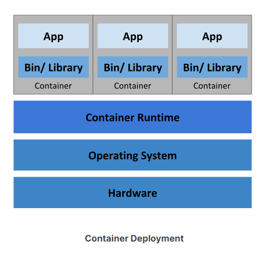


**K8S Teoria**

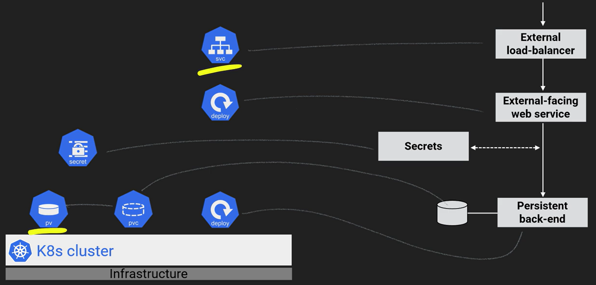


## **2.2 - Componentes do K8s**


## **2.3 - Componentes do Control Plane** (Master)

Os componentes da camada de gerenciamento tomam decisões globais sobre o cluster (por exemplo, agendamento de *pods*), bem como detectam e respondem aos eventos do cluster (por exemplo, iniciando um novo *[pod](https://kubernetes.io/docs/concepts/workloads/pods/pod-overview/)* quando o campo `replicas` de um *Deployment* não está atendido).

https://kubernetes.io/docs/concepts/overview/components/

**Sempre no node MASTER**

### **2.3.1 - ETCD**

https://kubernetes.io/pt-br/docs/concepts/overview/components/

Armazenamento de valor de chave consistente e altamente disponível usado como armazenamento de apoio do Kubernetes para todos os dados do cluster.

- No **[ETCD](https://kubernetes.io/docs/concepts/overview/components/#etcd)** são armazenados o estado do cluster, rede e outras informações persistentes.
- É Stateful. 
- Se seu cluster Kubernetes usa etcd como armazenamento de apoio, certifique-se de ter um plano de [backup](https://kubernetes.io/docs/tasks/administer-cluster/configure-upgrade-etcd/#backing-up-an-etcd-cluster) para esses dado.

**2.3.1.1 - Comandos**

| Descrição          | Comando                         |
| ------------------ | ------------------------------- |
| Lista pods do etcd | kubectl get pods -n kube-system |
|                    |                                 |
|                    |                                 |


### **2.3.2 - kube-apiserver**

https://kubernetes.io/docs/concepts/overview/components/#kube-apiserver

**[kube-apiserver](https://kubernetes.io/docs/concepts/overview/components/#kube-apiserver)** é a central de operações do cluster k8s. Todas as chamadas, internas ou externas são tratadas por ele. Ele é o único que conecta no ETCD.

O servidor de API é um componente da [Camada de gerenciamento](https://kubernetes.io/pt-br/docs/reference/glossary/?all=true#term-control-plane) do Kubernetes que expõe a API do Kubernetes. O servidor de API é o *front end* para a camada de gerenciamento do Kubernetes.

O kube-apiserver foi projetado para ser escalonado horizontalmente — ou seja, ele pode ser escalado com a implantação de mais instâncias. Você pode executar várias instâncias do kube-apiserver e balancear (balanceamento de carga, etc) o tráfego entre essas instâncias.

**2.3.2.1 - Comandos**

| Descrição                | Comando                         |
| ------------------------ | ------------------------------- |
| Lista pods do api-server | kubectl get pods -n kube-system |
|                          |                                 |
|                          |                                 |

### **2.4.3 - [kube-scheduller](https://kubernetes.io/docs/concepts/overview/components/#kube-apiserver)** 

https://kubernetes.io/pt-br/docs/concepts/overview/components/

**[kube-scheduller](https://kubernetes.io/docs/concepts/overview/components/#kube-apiserver)** usa um algoritmo para verificar em qual node o pod deverá ser hospedado. Ele verifica os recursos disponíveis do node para verificar qual o melhor node para receber aquele pod.

**2.3.1.1 - Comandos**

| Descrição          | Comando                         |
| ------------------ | ------------------------------- |
| Lista pods do etcd | kubectl get pods -n kube-system |
|                    |                                 |
|                    |                                 |

### **2.4.4 - [kube-controller-manager](https://kubernetes.io/docs/concepts/overview/components/#cloud-controller-manager)** 

https://kubernetes.io/pt-br/docs/concepts/overview/components/

**[kube-controller-manager](https://kubernetes.io/docs/concepts/overview/components/#cloud-controller-manager)** é o controle principal que interage com o `kube-apiserver` para determinar o seu estado. Se o estado não bate, o manager irá contactar o controller necessário para checar seu estado desejado. Tem diversos controllers em uso como: os endpoints, namespace e replication.

Componente da camada de gerenciamento que executa os processos de [controlador](https://kubernetes.io/docs/concepts/architecture/controller/).

Logicamente, cada *[controlador](https://kubernetes.io/docs/concepts/architecture/controller/)* está em um processo separado, mas para reduzir a complexidade, eles todos são compilados num único binário e executam em um processo único.

Alguns tipos desses controladores são:

- Controlador de nó: responsável por perceber e responder quando os nós caem.

- Controlador de *Job*: Observa os objetos *Job* que representam tarefas únicas e, em seguida, cria *pods* para executar essas tarefas até a conclusão.

- Controlador de *endpoints*: preenche o objeto *Endpoints* (ou seja, junta os Serviços e os *pods*).

- Controladores de conta de serviço e de *token*: crie contas padrão e *tokens* de acesso de API para novos *namespaces*.


**2.3.1.1 - Comandos**

| Descrição          | Comando                         |
| ------------------ | ------------------------------- |
| Lista pods do etcd | kubectl get pods -n kube-system |
|                    |                                 |
|                    |                                 |

### **2.4.6 - cloud-controller-manager**

Um componente da [camada de gerenciamento](https://kubernetes.io/pt-br/docs/reference/glossary/?all=true#term-control-plane) do Kubernetes que incorpora a lógica de controle específica da nuvem. O gerenciador de controle de nuvem permite que você vincule seu *cluster* na API do seu provedor de nuvem, e separar os componentes que interagem com essa plataforma de nuvem a partir de componentes que apenas interagem com seu cluster.


### **2.3.4 - kubeadm**

https://kubernetes.io/docs/reference/setup-tools/kubeadm/

O kubeadm executa as ações necessárias para obter um cluster mínimo viável instalado e funcionando. Por design, ele se preocupa apenas com a inicialização, não com o provisionamento de máquinas. 

**2.4.4.4 - Comandos**

| Descrição                                                    | Comando                                                |
| ------------------------------------------------------------ | ------------------------------------------------------ |
| kubeadm init --pod-network-cidr=10.24.4.0.0/16               | Inicia o cluster setanto o ip do pod-netowork -Flannel |
| kubeadm init --apiserver-advertise-address $(hostname -i)    |                                                        |
|                                                              |                                                        |
|                                                              |                                                        |
| kubeadm init --control-plane-endpoint "k8s-elb-01:6443" --upload-certs | Subir o cluster com elb                                |
| kubeadm token create --print-join-command                    | Restaurar o token do join p/ worker node               |
|                                                              |                                                        |
|                                                              |                                                        |
|                                                              |                                                        |


## **2.5 - Node Components**

https://kubernetes.io/pt-br/docs/concepts/overview/components/

Os componentes de nó são executados em todos os nós, mantendo os *pods* em execução e fornecendo o ambiente de execução do Kubernetes.	


### **2.5.1 - [kube-proxy](https://kubernetes.io/docs/concepts/overview/components/#kube-proxy)**

O **[kube-proxy](https://kubernetes.io/docs/concepts/overview/components/#kube-proxy)** é o responsável por gerenciar a rede para os contêineres, é o responsável por expor portas dos mesmos.

Trata da comunicação entre os Nodes.

- **CBR0 - Cluster Bridge Zero**  
- **IPTABLES Mode** - Antigo
- **IPVS Mode** - Novo

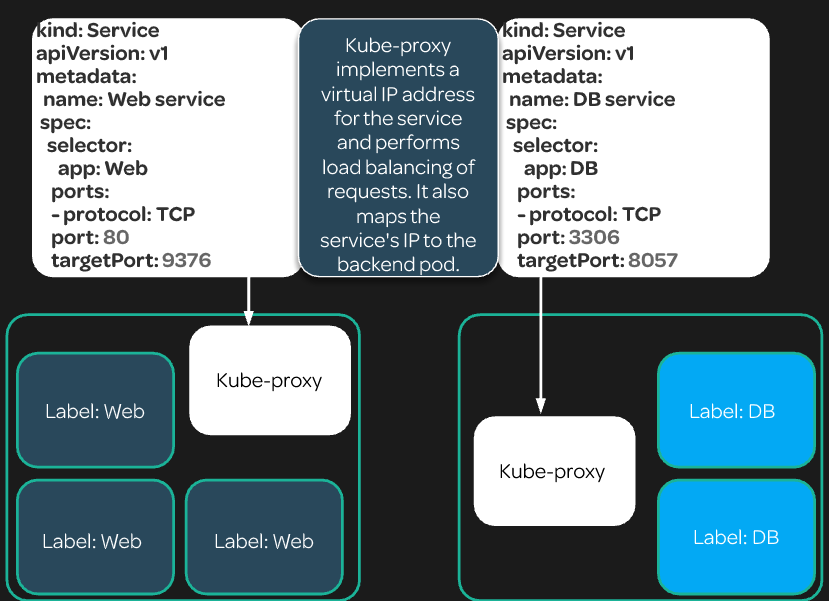

### **2.5.2 - Container runtime**

O agente de execução (*runtime*) de contêiner é o software responsável por executar os contêineres.


### **2.5.3 - kubelet**

https://kubernetes.io/docs/reference/command-line-tools-reference/kubelet/

O **[kubelet](https://kubernetes.io/docs/concepts/overview/components/#kubelet)** interage com o Docker instalado no node e garante que os contêineres que precisavam estar em execução realmente estão.

node agent

instalado em todos os nodes - master e worker


 

## **2.6 - Demais componentes**

- **2.61 - Pods**

- **2.6.2 - Namespaces**

- **2.6.3 - Network**

- **2.6.4 - DNS**

- **2.6.5 - Replicas e ReplicaSet**

- **2.6.6 - Services**

- **2.6.7 - Deployment**

- **2.6.8 - Worker Nodes**

  ###
  
  

- **Labels**
- **Controllers**
- **Storage**
- **Endpoints**


##############################################################################################

### **2.6.1 - POD´s**

https://kubernetes.io/docs/concepts/workloads/pods/

**[Pod](https://kubernetes.io/docs/concepts/workloads/pods/pod-overview/)** é a menor unidade que você irá tratar no k8s. 

- **Você poderá ter mais de um contêiner por Pod**, porém vale lembrar que eles dividirão os mesmos recursos, como por exemplo IP. 
- Uma das boas razões para se ter mais de um contêiner em um Pod é o fato de você ter os logs consolidados.
- O Pod, por poder possuir diversos contêineres, muitas das vezes se assemelha a uma VM, onde você poderia ter diversos serviços rodando compartilhando o mesmo IP e demais recursos.
- Os Pods podem se comunicar sem **NAT**.


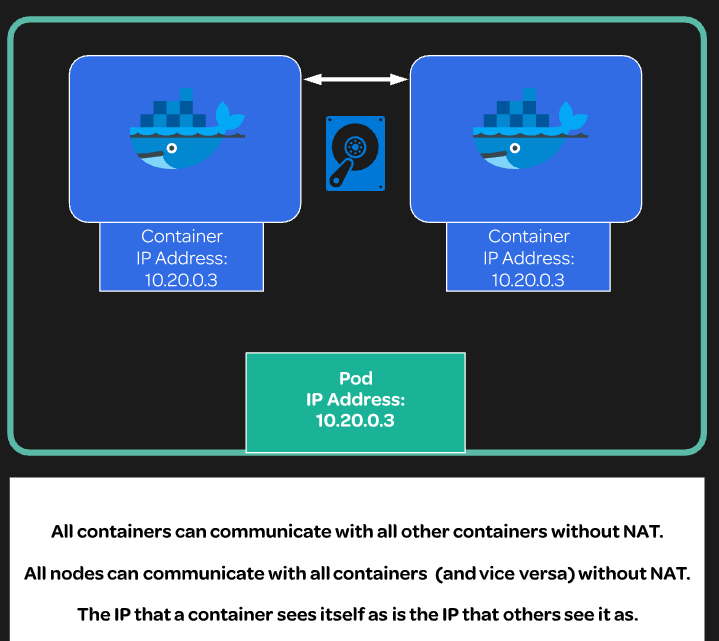


**LifeCycle**

https://kubernetes.io/docs/concepts/workloads/pods/pod-lifecycle/

**Entender mais do Lifecycle**

**Anatomia de um Pod ** 

```yaml
apiVersion: v1									-----> Versão da API
kind: Pod									    ----> O que quer criar 
metadata:
  name: examplepod								----> nome do pod
  namespace: pod-example						----> nome da namespace
spec:											---->  espeficicações do container
  volumes:										---->  volumes
  - name: html
    emptyDir: {}
  containers:
  - name: webcontainer							---->  nome do container
    image: nginx								---->  imagem do container
    volumeMounts:
    - name: html
      mountPath: /usr/share/nginx/html
  - name: filecontainer
    image: debian
    volumeMounts:
    - name: html
      mountPath: /html
    command: ["/bin/sh", "-c"]
    args:
      - while true; do
         date >> /html/index.html;
         sleep 1;
        done
```


#### **2.3.1.1- Comandos**

| Descrição                                                    | Comando                                     |
| :----------------------------------------------------------- | ------------------------------------------- |
| Editar pod                                                   | kubect edit pod "nomedopod"                 |
| Lista todos os pods de todos as namespaces                   | kubectl get pods --all-namespaces           |
| Lista todos os pods de todos as namespaces  dentro dos worker nodes | kubectl get pods --all-namespaces -o wide   |
| Deleta Pod                                                   | kubectl delete pod "nomepod" -n "namespace" |
| Create Pod                                                   | kubectl create -f pod-exmeple.yaml          |
|                                                              |                                             |
|                                                              |                                             |
|                                                              |                                             |
|                                                              |                                             |


##############################################################################################

### **2.6.2 - Namespaces**

https://kubernetes.io/docs/concepts/overview/working-with-objects/namespaces/

Os namespaces fornecem um escopo para nomes. Os nomes dos recursos precisam ser exclusivos em um namespace, mas não entre os namespaces.

Específica com "**-n**", se não especificar nenhuma ele lista da namespace "*default*". 

#### **2.3.3.1 - Comandos**

| Descrição         | Comandos                                               |
| ----------------- | ------------------------------------------------------ |
| Lista namespaces  | kubectl get namespace / kubectl get ns                 |
| Cria namespaces   | kubectl create namespace "nomedanamespace"             |
| Deleta namespaces | kubectl delete namespaces <insert-some-namespace-name> |
|                   |                                                        |
|                   |                                                        |
|                   |                                                        |
|                   |                                                        |
|                   |                                                        |
|                   |                                                        |


Create a new YAML file called `my-namespace.yaml` with the contents:

```yaml
apiVersion: v1
kind: Namespace
metadata:
  name: <insert-namespace-name-here>
```

Then run:

```
kubectl create -f ./my-namespace.yaml
```


### **Setting the namespace for a request**

To set the namespace for a current request, use the `--namespace` flag.

For example:

```shell
kubectl run nginx --image=nginx --namespace=<insert-namespace-name-here>
kubectl get pods --namespace=<insert-namespace-name-here>
```


No POD a namespace é declarada no metadata. 

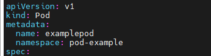


##############################################################################################

### **2.6.4 - DNS**

https://kubernetes.io/docs/concepts/services-networking/dns-pod-service/

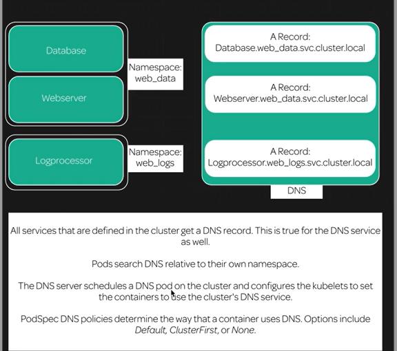

 Kubelet define esse arquivo para cada pod.

```yaml
root@examplepod:/# cat /etc/resolv.conf
nameserver 10.96.0.10
search pod-example.svc.cluster.local svc.cluster.local cluster.local ec2.internal
options ndots:5

```


##############################################################################################

### **2.6.5 - Network**

https://kubernetes.io/pt-br/docs/concepts/cluster-administration/networking/


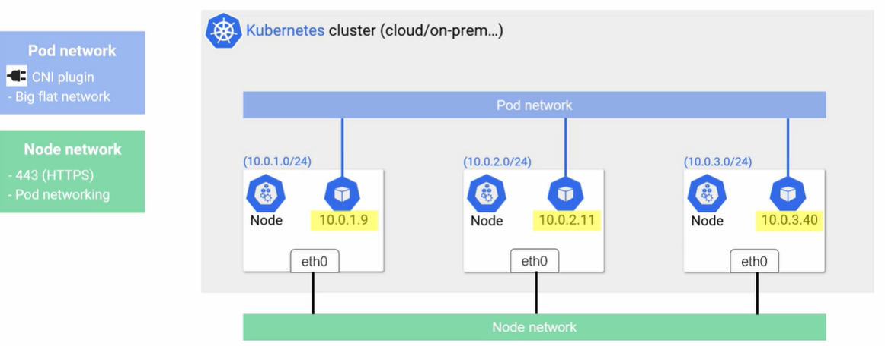


**Container Network Interface**

Para prover a rede para os contêineres, o k8s utiliza a especificação do **CNI**, Container Network Interface.

CNI é uma especificação que reúne algumas bibliotecas para o desenvolvimento de plugins para configuração e gerenciamento de redes para os contêineres. Ele provê uma interface comum entre as diversas soluções de rede para o k8s. Você encontra diversos plugins para AWS, GCP, Cloud Foundry entre outros.

Mais informações em: https://github.com/containernetworking/cni

Enquanto o CNI define a rede dos pods, ele não te ajuda na comunicação entre os pods de diferentes nodes.

As características básicas da rede do k8s são:

- Todos os pods conseguem se comunicar entre eles em diferentes nodes;
- Todos os nodes pode se comunicar com todos os pods;
- **Não utilizar NAT.**

**Todos os IPs dos pods e nodes são roteados sem a utilização de [NAT](https://en.wikipedia.org/wiki/Network_address_translation). **

Isso é solucionado com a utilização de algum software que te ajudará na criação de uma rede Overlay. Seguem alguns:

- [Weave](https://www.weave.works/docs/net/latest/kube-addon/)
- [Flannel](https://github.com/coreos/flannel/blob/master/Documentation/kubernetes.md)
- [Canal](https://github.com/tigera/canal/tree/master/k8s-install)
- [Calico](https://docs.projectcalico.org/latest/introduction/)
- [Romana](http://romana.io/)
- [Nuage](https://github.com/nuagenetworks/nuage-kubernetes/blob/v5.1.1-1/docs/kubernetes-1-installation.rst)
- [Contiv](http://contiv.github.io/)

**Mais utilizados Waeve ou Flannel. **

Mais informações em: https://kubernetes.io/docs/concepts/cluster-administration/addons/


**2.6.5.1 - Comandos**

| Descrição             | Comando                         |
| --------------------- | ------------------------------- |
| Lista pods do coredns | kubectl get pods -n kube-system |
|                       |                                 |
|                       |                                 |

##############################################################################################

**2.3.5 - Replicas e Replicas Set**

https://kubernetes.io/docs/concepts/workloads/controllers/replicaset/

O objetivo de um **ReplicaSet** é manter um conjunto estável de pods de réplica em execução a qualquer momento. Como tal, costuma ser usado para garantir a disponibilidade de um número especificado de pods idênticos

**Anatomia de um replica set.** 

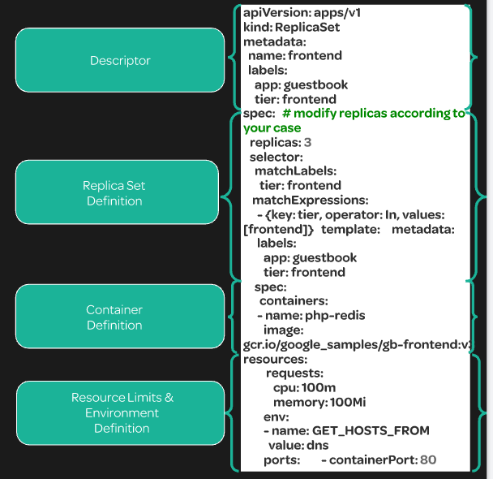


Detalhamento do arquivo yaml

```yaml
apiVersion: apps/v1
kind: ReplicaSet
metadata:
  name: frontend
  labels:
    app: nginx
    tier: frontend
spec:
  replicas: 2  											--->> Numero de replicas
  selector:
    matchLabels: 
      tier: frontend
    matchExpressions:
      - {key: tier, operator: In, values: [frontend]}
  template:
    metadata:
      labels:
        app: nginx
        tier: frontend
    spec:
      containers:
      - name: nginx
        image: darealmc/nginx-k8s:v1
        ports:
        - containerPort: 80
```

Para verificar se uma replica set controla o pod:

descbribe no pod

verifique a saida: Controlled By

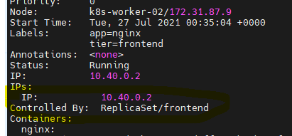

**2.3.5.1 - Comandos**


| Descrição               | Comando                                                      |
| ----------------------- | ------------------------------------------------------------ |
| Describe na replica set | kubectl describe rs/"nomedareplica"                          |
| Escala replicas         | kubectl scale rs/"nomedareplica"--replicas="numero de replicas" |
| Deleta replica set      | kubectl delete rs/"nomedareplica"                            |
|                         | kubectl get rs/"nomedareplica"                               |
|                         |                                                              |
|                         |                                                              |
|                         |                                                              |
|                         |                                                              |
|                         |                                                              |


##############################################################################################

### **2.6.6 - Services**

https://kubernetes.io/docs/concepts/services-networking/service/

Uma maneira abstrata de expor um aplicativo em execução em um conjunto de [Pods](https://kubernetes.io/docs/concepts/workloads/pods/) como um serviço de rede.


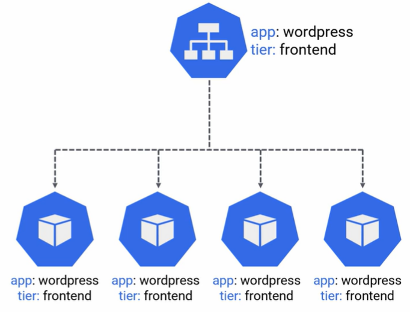

Com o Kubernetes, você não precisa modificar seu aplicativo para usar um mecanismo de descoberta de serviço desconhecido. O Kubernetes fornece aos pods seus próprios endereços IP e um único nome DNS para um conjunto de pods e pode fazer o balanceamento de carga entre eles. 

É uma forma de você expor a comunicação através de um **NodePort** ou **LoadBalancer** para distribuir as requisições entre diversos Pods daquele Deployment. Funciona como um balanceador de carga.

**Tipos de Services:**

- **NodePort:** Sempre acessível de **DENTRO** do Cluster - Por Porta
- **ClusterIP:** Sempre acessível de **FORA** do Cluster - Por IP
- **LoadBalancer:** Integração com Cloud Publica

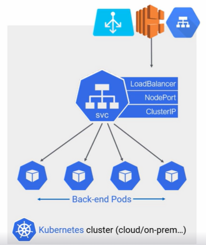

**O IP e o nome do Service nunca muda.** 


O vinculo entre o Service e o Pod é feito pelo label informado no Selector conforme abaixo:

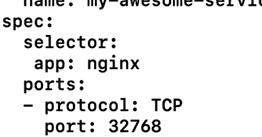

Ele cria um IP virtual para os pods, mas o endpoint continua sendo o ip dos pods. 

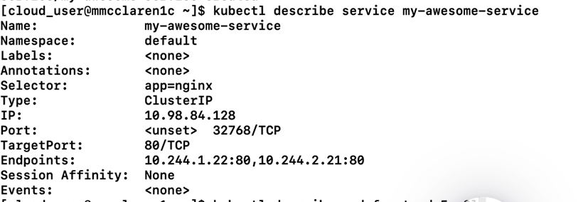


**Anatomia do Service**

```yaml
apiVersion: v1
kind: Service
metadata:
  labels:
    run: nginx
  name: nginx-clusterip
  namespace: default
spec:
  externalTrafficPolicy: Cluster
  ports:
  - port: 80
    protocol: TCP
    targetPort: 80
  selector:					----> determina quais pod´s farão parte do service
    run: nginx				----> determina quais pod´s farão parte do service
    sessionAffinity: None
  type: ClusterIP
```


#### **2.6.6.1 - Comandos**

| Descrição         | Comandos                               |
| ----------------- | -------------------------------------- |
| Lista Services    | kubectl get services / kubectl get svc |
| Describe Services | kubectl describe svc "*service-name*"  |
|                   |                                        |
|                   |                                        |
|                   |                                        |
|                   |                                        |
|                   |                                        |
|                   |                                        |
|                   |                                        |

##############################################################################################

**2.6.7 - Deployment**

https://kubernetes.io/docs/concepts/workloads/controllers/deployment/

Você descreve um *estado desejado* em uma implantação, e a implantação [Controlador](https://kubernetes.io/docs/concepts/architecture/controller/) altera o estado real para o estado desejado em uma taxa controlada. Você pode definir implantações para criar novos **ReplicaSets** ou remover implantações existentes e adotar todos os seus recursos com novas implantações.

O deployment é uma ótima maneira de automatizar o gerenciamento de seus pods. O deployment permite que você especifique um estado desejado para um conjunto de pods. O cluster trabalhará constantemente para manter o estado desejado.

- **Scaling**

  Entender mais

- **Rolling updates**

  Entender mais

- **Self-Healing**

  Entender mais

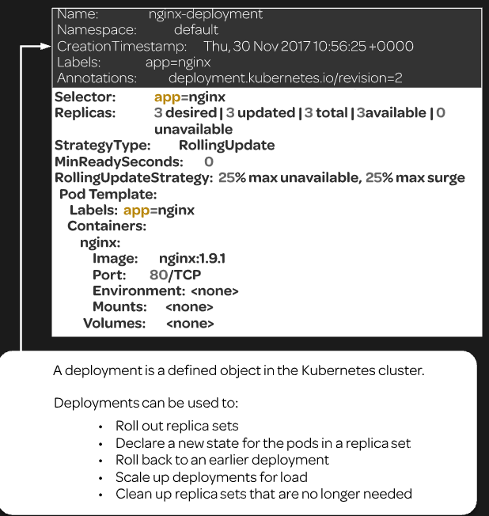


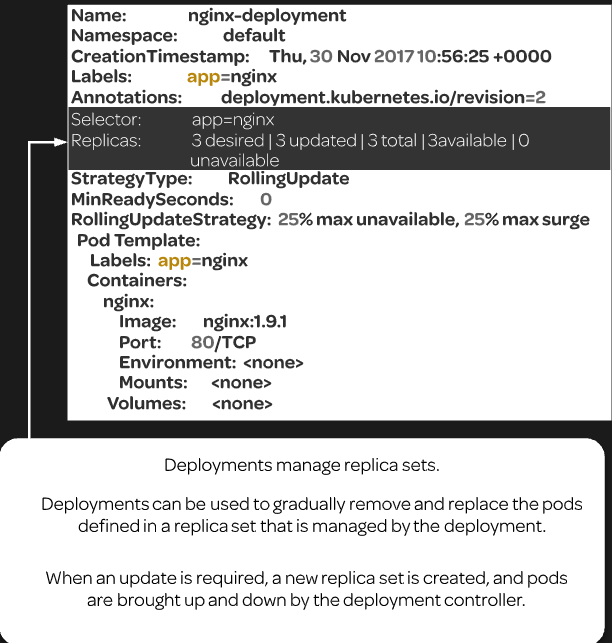


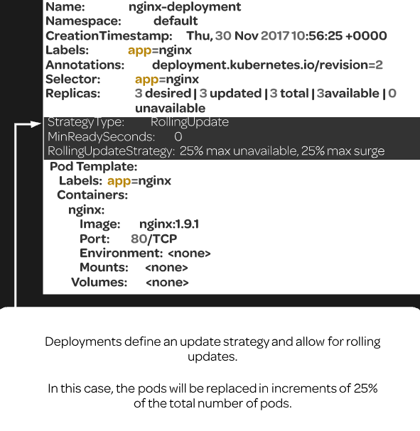


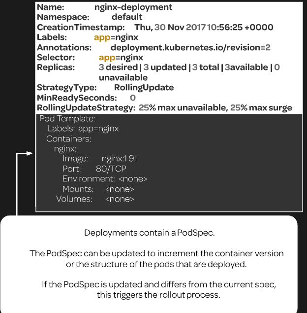

```yaml
apiVersion: apps/v1
kind: Deployment
metadata:
  name: example-deployment 
  labels: 
    app: nginx
spec:
  replicas: 2							----> ReplicaSet
  selector:
    matchLabels:
      app: nginx
  template:
    metadata:
      labels:
        app: nginx 
    spec: 
      containers:
      - name: nginx
        image: darealmc/nginx-k8s:v1
        ports:
        - containerPort: 80
```

**2.6.7.1 - Comandos**

| Descrição                          | Comando                                                      |
| ---------------------------------- | ------------------------------------------------------------ |
| Altera imagem no deploy            | kubectl set image deployment.v1.apps/"*nome-deployment*" nginx="image" |
| Para acompanhar as atualizações    | kubectl describe deploy "*nome-deployment*"                  |
| Cria deployment básico             | kubectl create deployment "*nome-deployment*" --image=nginx  |
| Escala deployment                  | kubectl scale deployment "*nome-deployment*" --replicas="*qde-replicas*" |
| Opção DryRun não Cria o Deployment | kubectl create deployment meu-nginx --image=nginx **--dry-run=client** -o yaml > deployment-template.yaml |
|                                    |                                                              |
|                                    |                                                              |
|                                    |                                                              |
|                                    |                                                              |
|                                    |                                                              |
|                                    |                                                              |

##############################################################################################

**2.6.8 - Worker Nodes**

https://kubernetes.io/docs/concepts/architecture/nodes/


**2.6.8.1 - Comandos**

| Descrição                   | Comando                                                  |
| --------------------------- | -------------------------------------------------------- |
| Lista Nodes                 | kubectl get nodes                                        |
| Describe Node               | kubectl describe node "*node_name*"                      |
| Pegar bloco de ip dos nodes | kubectl get nodes -o jsonpath='{.items[*].spec.podCIDR}' |
|                             |                                                          |

##############################################################################################

**2.3.5 - Endpoints**

**Sempre pega com o Endpoint os pods que estão no Selector.**

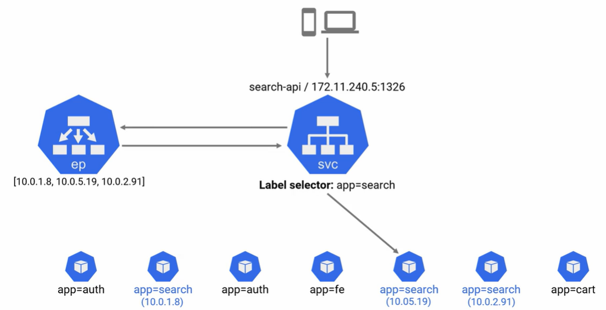

##############################################################################################


**2.3.5 - Labels**

https://kubernetes.io/docs/concepts/overview/working-with-objects/labels/

Labels permitem que os usuários mapeiem suas próprias estruturas organizacionais em objetos do sistema de maneira fracamente acoplada, sem exigir que os clientes armazenem esses mapeamentos.

Uso para filtros 

É um par chave-valor

Pode-se usar até 3.

**Labels recomentados**

https://kubernetes.io/docs/concepts/overview/working-with-objects/common-labels/

**2.3.5.1 - Comandos**


| Descrição                               | Comando                                                      |
| --------------------------------------- | ------------------------------------------------------------ |
| Listas todos os pods com Label          | kubectl get pods --show-labels                               |
| Listar os pods com o Label especificado | kubectl get pods -l dc="label"                               |
| Lista os pods com o label "DC"          | kubectl get pods -L "label"                                  |
| Setar Label no pod                      | kubectl label pod "nomedopod" "label"="valor" -n "namespace" |
| Deletar pod com Label especifico        | kubectl delete pod -l "label"="valor" -n "namespace"         |
|                                         |                                                              |
|                                         |                                                              |
|                                         |                                                              |
|                                         |                                                              |


**[Supervisord](http://supervisord.org/)** é o responsável por monitorar e restabelecer, se necessário, o `kubelet` e o Docker. Por esse motivo, quando existe algum problema em relação ao kubelet, como por exemplo o uso do driver `cgroup` diferente do que está rodando no Docker, você perceberá que ele ficará tentando subir o kubelet frequentemente.


## **Volumes**

**EmptyDir** 

Um volume do tipo **EmptyDir** é criado sempre que um Pod é atribuído a um nó existente. Esse volume é criado inicialmente vazio, e todos os contêineres do Pod podem ler e gravar arquivos no volume.

Esse volume não é um volume com persistência de dados. Sempre que o Pod é removido de um nó, os dados no `EmptyDir` são excluídos permanentemente. É importante ressaltar que os dados não são excluídos em casos de falhas nos contêineres.

Disco disponível somente enquando o pod estiver rodando.

Recomendado para logs por exemplo.

Disco no Node em /var/lib/kubelet/pods , find . -iname "*nomedodisco*"


**Persistent Volume**

O subsistema **PersistentVolume** fornece uma API para usuários e administradores que resume detalhes de como o armazenamento é fornecido e consumido pelos Pods. Para o melhor controle desse sistema foi introduzido dois recursos de API: `PersistentVolume` e `PersistentVolumeClaim`.

Um **PersistentVolume** (PV) é um recurso no cluster, assim como um nó. Mas nesse caso é um recurso de armazenamento. O PV é uma parte do armazenamento no cluster que foi provisionado por um administrador. Os PVs tem um ciclo de vida independente de qualquer pod associado a ele. Essa API permite armazenamentos do tipo: NFS, ISCSI ou armazenamento de um provedor de nuvem específico.

Um **PersistentVolumeClaim** (PVC) é semelhante a um Pod. Os Pods consomem recursos de um nó e os PVCs consomem recursos dos PVs.

Mas o que é um PVC? Nada mais é do que uma solicitação de armazenamento criada por um usuário.

Vamos criar um `PersistentVolume` do tipo `NFS`, para isso vamos instalar os pacotes necessários para criar um NFS Server no GNU/Linux.

Sequencia: Cria o **PV** depois o **PVC**.


## Kubectl Taint

O **Taint** nada mais é do que adicionar propriedades ao nó do cluster para impedir que os pods sejam alocados em nós inapropriados.

Por exemplo, todo nó `master` do cluster é marcado para não receber pods que não sejam de gerenciamento do cluster.

O nó `master` está marcado com o taint `NoSchedule`, assim o scheduler do Kubernetes não aloca pods no nó master, e procurar outros nós no cluster sem essa marca.

```yaml
## NoSchedule - Novos containers não são executados no node
**Habilitado** - kubectl taint node k8s-worker-01 key1=value1:NoSchedule
**Desabilitado** - kubectl taint node k8s-worker-01 key1=value1:NoSchedule-

## NoExecute - Não executa containers no node, ele mata e migra para outro node
**Habilitado** - kubectl taint node elliot-03 key1=value1:NoExecute
**Desabilitado** - kubectl taint node elliot-03 key1=value1:NoExecute-
```


## **Label**

O **Node Selector** é uma forma de classificar nossos nodes como por exemplo nosso node `elliot-02` que possui disco **SSD** e está localizado no DataCenter `UK`, e o node `elliot-03` que possui disco **HDD** e está localizado no DataCenter `Netherlands`.

Para criar pods em nodes com o Label "disk""HDD", adiciona no deployment  no spec do pod a opção abaixo.

```yaml
 nodeSelector:
              disk: HDD
```


## **Setup do K8S**

1 - Inicia o Master Node

```
kubeadm init --apiserver-advertise-address $(hostname -i)
```

2 - Seta saída do kubeadm

```
sudo cp /etc/kubernetes/admin.conf $HOME/
sudo chown $(id -u):$(id -g) $HOME/admin.conf
export KUBECONFIG=$HOME/admin.conf
```

3 - Configura plugin rede

```
kubectl apply -f "https://cloud.weave.works/k8s/net?k8s-version=$(kubectl version \|base64 \|tr -d '\n')"
```

4 - Join dos nodes

```
kubeadm join --discovery-token-unsafe-skip-ca-verification --token=102952.1a7dd4cc8d1f4cc5 172.17.0.69:6443
```


## **Best  Practices**

- **ETCD** - em produção sempre manter fora do Master e em HA


## **Exemplos**

**service-clusterip.yaml**

```yaml
apiVersion: v1
kind: Service
metadata:
  labels:
    run: nginx
  name: nginx-clusterip
  namespace: default
spec:
  externalTrafficPolicy: Cluster
  ports:
  - port: 80
    protocol: TCP
    targetPort: 80
  selector:
    run: nginx
  sessionAffinity: None
  type: ClusterIP
```

**service-nodeip.yaml**

```yaml
apiVersion: v1
kind: Service
metadata:
  labels:
    run: nginx
  name: nginx-nodeport
  namespace: default
spec:
  externalTrafficPolicy: Cluster
  ports:
  - nodePort: 32548
    port: 80
    protocol: TCP
    targetPort: 80
  selector:
    run: nginx
  sessionAffinity: ClientIP
  type: NodePort
```


**service-loadbalancer.yaml**

```yaml
apiVersion: v1
kind: Service
metadata:
  labels:
    run: nginx
  name: nginx-loadbalancer
  namespace: default
spec:
  externalTrafficPolicy: Cluster
  ports:
  - nodePort: 32548
    port: 80
    protocol: TCP
    targetPort: 80
  selector:
    run: nginx
  sessionAffinity: None
  type: LoadBalancer
```


**deployment-limitado.yaml** 

```yaml
apiVersion: extensions/v1beta1
kind: Deployment
metadata:
  labels:
    run: nginx
  name: nginx-limitado
  namespace: default
spec:
  progressDeadlineSeconds: 600
  replicas: 1
  revisionHistoryLimit: 2
  selector:
    matchLabels:
      run: nginx
  strategy:
    rollingUpdate:
      maxSurge: 25%
      maxUnavailable: 25%
    type: RollingUpdate
  template:
    metadata:
      creationTimestamp: null
      labels:
        run: nginx
    spec:
      containers:
      - image: nginx
        imagePullPolicy: Always
        name: nginx
        ports:
        - containerPort: 80
          protocol: TCP
        resources:
          limits:  ## Quando o K8S vai liberar para esse deployment
            memory: 128Mi
            cpu: 1
          requests: ## Minimo garantido que o K8S vai liberar para esse deployment
            memory: 96Mi
            cpu: 1
        terminationMessagePath: /dev/termination-log
        terminationMessagePolicy: File
      dnsPolicy: ClusterFirst
      restartPolicy: Always
      schedulerName: default-scheduler
      securityContext: {}
      terminationGracePeriodSeconds: 30
```

```yaml
Atenção! 1 core de CPU corresponde a 1000m (1000 milicore). Ao especificar 200m, estamos querendo reservar 20% de 1 core da CPU. Se fosse informado o valor 0.2 teria o mesmo efeito, ou seja, seria reservado 20% de 1 core da CPU.
```


# **Comandos Kubernetes**


https://kubernetes.io/docs/reference/kubectl/overview/

A figura a seguir mostra a estrutura dos principais comandos do `kubectl`.

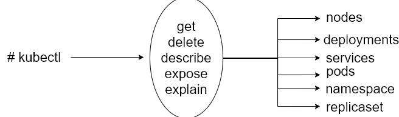


|                           Comando                            | Descrição                                                    |
| :----------------------------------------------------------: | :----------------------------------------------------------- |
|                                                              |                                                              |
|                                                              |                                                              |
|                 kubectl get componentstatus                  | Status dos componentes                                       |
|                     kubectl cluster-info                     | Informações do cluster                                       |
|                  kubectl cluster-info dump                   | Gerar Dump das infos do cluster                              |
|               kubectl run nginx --image=nginx                | Cria um POD                                                  |
|              kubectl get pods nginx **-o yaml**              | mostra o manifesto do pod                                    |
| kubectl run meu-nginx --image nginx **--dry-run=client** -o yaml > pod-template.yaml | Opção DryRun não Cria o POD                                  |
|                                                              |                                                              |
|                  kubectl explain "recurso"                   | Explica o recurso "main page"                                |
|                        kubectl expose                        | Cria Services                                                |
|                    kubectl logs -f nginx                     | Analise de Logs                                              |
|                                                              |                                                              |
|                                                              |                                                              |
|  echo "source <(kubectl completion bash)" >> /root/.bashrc   | auto complete                                                |
|                                                              |                                                              |
|      kubectl get pods "nomedopod" -o yaml > meupod.yaml      | Cria um arquivo yaml com as infos do pod                     |
| kubectl get pods "nomedopod" -o yaml --export > meupod.yaml  | Cria um arquivo yaml com as infos do pod, mas sem infos especificas |
|                      kubeadm token list                      | Lista Tokens                                                 |
|                                                              |                                                              |
|                                                              |                                                              |
|                                                              |                                                              |
|                                                              |                                                              |
|                                                              |                                                              |
|                                                              |                                                              |
|                                                              |                                                              |
|                                                              |                                                              |
|                                                              |                                                              |
|                                                              |                                                              |

# **Best Practices**

**Tipos de topologias de K8s multi-master**

https://kubernetes.io/docs/setup/production-environment/tools/kubeadm/ha-topology/


**Instalação kubeadm, kubelet e kubectl**

https://kubernetes.io/docs/setup/production-environment/tools/kubeadm/install-kubeadm/


**Instalação Kubernetes multi-master**

https://kubernetes.io/docs/setup/production-environment/tools/kubeadm/high-availability/


**HAproxy**

https://www.haproxy.org/


**Options for Highly Available topology**

https://kubernetes.io/docs/setup/production-environment/tools/kubeadm/ha-topology/


**Creating Highly Available clusters with kubeadm**

https://kubernetes.io/docs/setup/production-environment/tools/kubeadm/high-availability/
