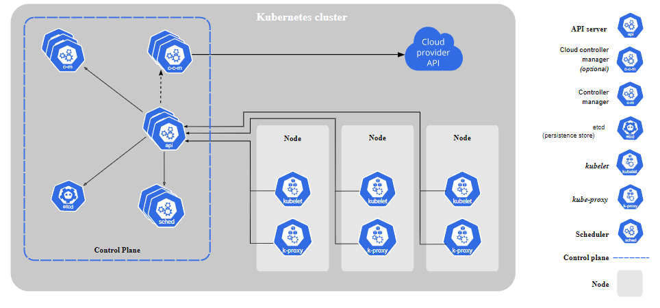
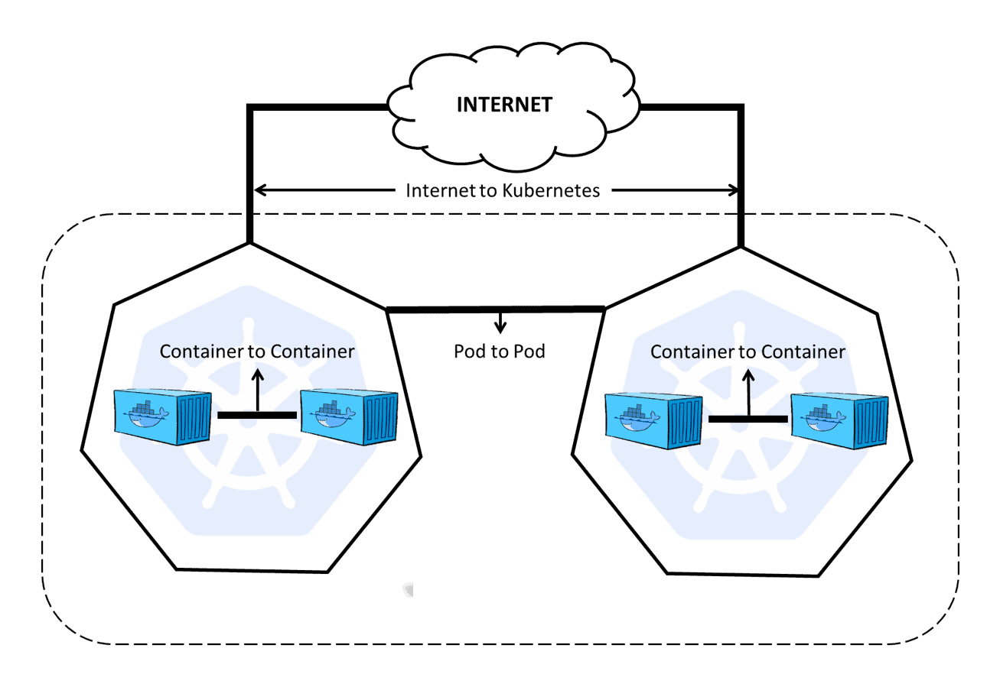

# **Treinamentos  Kubernetes**

# Sumário


# **1 - Treinamentos**

Colocar ✔ quando concluído. 

## **1.1 - Linux Foundation** ✔ 

https://learning.edx.org/course/course-v1:LinuxFoundationX+LFS158x+3T2020/home


## **1.2 - Curso de Introdução ao Kubernetes**

https://docs.google.com/presentation/d/1weqpBWa9FNjKc1ugCUIpwYYquvoIOFbUvEcZ9ZYapAg/edit#slide=id.g23786ddafa_0_68

- Apresentação https://www.youtube.com/watch?v=RuNTvYejG90&feature=youtu.be ✔ 
- 01 - Revisão docker - https://www.youtube.com/watch?v=bcRArpK00OU&feature=youtu.be ✔ 
- 02 - O que é Kubernetes?https://www.youtube.com/watch?v=X2r09kPi8aA&feature=youtu.be ✔ 
- 03 - Arquitetura do K8s - https://www.youtube.com/watch?v=bPFxwwSfSmk&feature=youtu.be ✔ 
- 04 Conceitos importantes do K8s - https://www.youtube.com/watch?v=Y0kHzwifFEA&feature=youtu.be ✔ 
- 05 Instalação dos componentes do K8s - https://www.youtube.com/watch?v=7H61VJV0YI8&feature=youtu.be ✔ 
- 06 Configuração do K8s (53:48) - https://www.youtube.com/watch?v=V1g0alYqI1w&feature=youtu.be
- 07 ReplicaSet (7:14) - https://www.youtube.com/watch?v=qfiQyTqzUqU&feature=youtu.be
- 08 Deployment (18:52) - https://www.youtube.com/watch?v=2JbQkTF6TzU&feature=youtu.be
- 09 Service (27:30) - https://www.youtube.com/watch?v=zGqMvzbWAJc&feature=youtu.be
- 10 Microservices (7:48) - https://www.youtube.com/watch?v=SS748X6xvdk&feature=youtu.be


## **1.3 - LinuxTips**

### **1.3.1 - Descomplicando o Kubernetes** 

https://github.com/badtuxx/DescomplicandoKubernetes


### **1.3.2 - Canary Deploy**


https://www.youtube.com/watch?v=CTvsdWZrAW0

https://github.com/badtuxx/k8s-canary-deploy-example


## **1.5 - AcloudGuru**


### **1.5.1 - Kubernetes Quick Start**


### **1.5.2 - Kubernetes Essentials**


### **1.5.3 - Introduction to Kubernetes**


### **1.5.4 - Kubernetes Deep Dive**


### **1.5.4 - Helm Deep Dive V3**


### **1.5.5 - Monitoring Kubernetes With Prometheus**


### **1.5.6 - AIOps Essentials (Autoscaling Kubernetes with Prometheus Metrics)**


### **1.5.7 - Kubernetes the Hard Way**


### **1.5.8 - Kubernetes Security**


### **1.5.9 - Kubernetes Security (Advanced Concepts)**


### **1.5.10 - Advanced Networking with Kubernetes on AWS**


### **1.5.11 - Backing up and Restoring Kubernetes Data in etcd**


### **1.5.12 - Certified Kubernetes Administrator (CKA)**


## **1.6 - AWS**


## **1.7 - Monitoramento**

https://kubedev.io/bonus-monitoramento/

# **2 - Anotações**

## **2.1 - Documentação oficial**

https://kubernetes.io/pt-br/docs/home/


# 

## **2.2 - Laboratório K8S**

**Play with K8s**

https://labs.play-with-k8s.com/

**Katacoda**

https://www.katacoda.com/courses/kubernetes


## **2.3 - Componentes do K8s**




## **2.4 - Componentes do Control Plane**

Os componentes da camada de gerenciamento tomam decisões globais sobre o cluster (por exemplo, agendamento de *pods*), bem como detectam e respondem aos eventos do cluster (por exemplo, iniciando um novo *[pod](https://kubernetes.io/docs/concepts/workloads/pods/pod-overview/)* quando o campo `replicas` de um *Deployment* não está atendido).

https://kubernetes.io/docs/concepts/overview/components/

**Sempre no node MASTER**

### **2.4.1 - ETCD**

No **[ETCD](https://kubernetes.io/docs/concepts/overview/components/#etcd)** são armazenados o estado do cluster, rede e outras informações persistentes.

Armazenamento de valor de chave consistente e altamente disponível usado como armazenamento de apoio do Kubernetes para todos os dados do cluster.

Se seu cluster Kubernetes usa etcd como armazenamento de apoio, certifique-se de ter um plano de [backup](https://kubernetes.io/docs/tasks/administer-cluster/configure-upgrade-etcd/#backing-up-an-etcd-cluster) para esses dado


### **2.4.2 - [kube-apiserver](https://kubernetes.io/docs/concepts/overview/components/#kube-apiserver)** 

https://kubernetes.io/docs/concepts/overview/components/#kube-apiserver

**[kube-apiserver](https://kubernetes.io/docs/concepts/overview/components/#kube-apiserver)** é a central de operações do cluster k8s. Todas as chamadas, internas ou externas são tratadas por ele. Ele é o único que conecta no ETCD.

Kubectl transforma de JSON e envia para o kube-apiserver


### **2.4.3 - [kube-scheduller](https://kubernetes.io/docs/concepts/overview/components/#kube-apiserver)** 

**[kube-scheduller](https://kubernetes.io/docs/concepts/overview/components/#kube-apiserver)** usa um algoritmo para verificar em qual node o pod deverá ser hospedado. Ele verifica os recursos disponíveis do node para verificar qual o melhor node para receber aquele pod.


### **2.4.4 - [kube-controller-manager](https://kubernetes.io/docs/concepts/overview/components/#cloud-controller-manager)** 

**[kube-controller-manager](https://kubernetes.io/docs/concepts/overview/components/#cloud-controller-manager)** é o controle principal que interage com o `kube-apiserver` para determinar o seu estado. Se o estado não bate, o manager irá contactar o controller necessário para checar seu estado desejado. Tem diversos controllers em uso como: os endpoints, namespace e replication.


### **2.4.5 - [kube-proxy](https://kubernetes.io/docs/concepts/overview/components/#kube-proxy)**

O **[kube-proxy](https://kubernetes.io/docs/concepts/overview/components/#kube-proxy)** é o responsável por gerenciar a rede para os contêineres, é o responsável por expor portas dos mesmos.

Trata da comunicação entre os Nodes. 


### **2.4.6 - cloud-controller-manager**

Um componente da [camada de gerenciamento](https://kubernetes.io/pt-br/docs/reference/glossary/?all=true#term-control-plane) do Kubernetes que incorpora a lógica de controle específica da nuvem. O gerenciador de controle de nuvem permite que você vincule seu *cluster* na API do seu provedor de nuvem, e separar os componentes que interagem com essa plataforma de nuvem a partir de componentes que apenas interagem com seu cluster.


## **2.5 - Node Components**

Os componentes de nó são executados em todos os nós, mantendo os *pods* em execução e fornecendo o ambiente de execução do Kubernetes.	

### **2.5.1 - kubelet**

https://kubernetes.io/docs/reference/command-line-tools-reference/kubelet/

O **[kubelet](https://kubernetes.io/docs/concepts/overview/components/#kubelet)** interage com o Docker instalado no node e garante que os contêineres que precisavam estar em execução realmente estão.

node agent

instalado em todos os nodes - master e worker


### **2.5.2 kubectl**

https://kubernetes.io/docs/reference/kubectl/overview/

A figura a seguir mostra a estrutura dos principais comandos do `kubectl`.

| [](https://github.com/badtuxx/DescomplicandoKubernetes/blob/main/images/kubernetes_commands.png) |
| ------------------------------------------------------------ |
| *Principais comandos [Ref: uploaddeimagens.com.br](https://uploaddeimagens.com.br/images/002/667/919/full/Kubernetes-Comandos.png)* |


## **2.6 - Demais componentes**

- **Master node**
- **Worker node**
- **Services**
- **Controllers**
- **Pods**
- **Namespaces e quotas**
- **Network e policies**
- **Storage**
- **Deployment**
- **ReplicaSet**
- **Services**


### **2.3.1 - POD´s**

https://kubernetes.io/docs/concepts/workloads/pods/

**[Pod](https://kubernetes.io/docs/concepts/workloads/pods/pod-overview/)** é a menor unidade que você irá tratar no k8s. Você poderá ter mais de um contêiner por Pod, porém vale lembrar que eles dividirão os mesmos recursos, como por exemplo IP. Uma das boas razões para se ter mais de um contêiner em um Pod é o fato de você ter os logs consolidados.

O Pod, por poder possuir diversos contêineres, muitas das vezes se assemelha a uma VM, onde você poderia ter diversos serviços rodando compartilhando o mesmo IP e demais recursos.

**LifeCycle**

https://kubernetes.io/docs/concepts/workloads/pods/pod-lifecycle/

#### **2.3.1.1- Comandos**

Editar pod 

```
kubect edit pod "nomedopod"
```


### **2.3.2 - [Services](https://kubernetes.io/docs/concepts/services-networking/service/)** 

É uma forma de você expor a comunicação através de um **NodePort** ou **LoadBalancer** para distribuir as requisições entre diversos Pods daquele Deployment. Funciona como um balanceador de carga.

#### **2.3.2.1 - Comandos**


### **2.3.3 - Namespaces**

https://kubernetes.io/docs/concepts/overview/working-with-objects/namespaces/

Os namespaces fornecem um escopo para nomes. Os nomes dos recursos precisam ser exclusivos em um namespace, mas não entre os namespaces.

Específica com "**-n**", se não especificar nenhuma ele lista da namespace "*default*". 

#### **2.3.3.1 - Comandos**

**Lista**

```shell
kubectl get namespace
```

**Create**

Create a new YAML file called `my-namespace.yaml` with the contents:

```yaml
apiVersion: v1
kind: Namespace
metadata:
  name: <insert-namespace-name-here>
```

Then run:

```
kubectl create -f ./my-namespace.yaml
```

Alternatively, you can create namespace using below command:

```
kubectl create namespace <insert-namespace-name-here>
```

**Delete**

```shell
kubectl delete namespaces <insert-some-namespace-name>
```


### **Setting the namespace for a request**

To set the namespace for a current request, use the `--namespace` flag.

For example:

```shell
kubectl run nginx --image=nginx --namespace=<insert-namespace-name-here>
kubectl get pods --namespace=<insert-namespace-name-here>
```


### **2.3.4 - kubeadm**

https://kubernetes.io/docs/reference/setup-tools/kubeadm/

O kubeadm executa as ações necessárias para obter um cluster mínimo viável instalado e funcionando. Por design, ele se preocupa apenas com a inicialização, não com o provisionamento de máquinas. 


**2.3.5 - Labels**

https://kubernetes.io/docs/concepts/overview/working-with-objects/labels/

Labels permitem que os usuários mapeiem suas próprias estruturas organizacionais em objetos do sistema de maneira fracamente acoplada, sem exigir que os clientes armazenem esses mapeamentos.

Uso para filtros 

É um par chave-valor

Pode-se usar até 3.

**Labels recomentados**

https://kubernetes.io/docs/concepts/overview/working-with-objects/common-labels/

**2.3.5.1 - Comandos**

Listas todos os pods com Label

```
kubectl get pods --show-labels
```

Listar os pods com o Label especificado

```
kubectl get pods -l dc="label"
```

Lista os pods com o label "DC"

```
kubectl get pods -L "label"
```

Setar Label no pod

```
kubectl label pod "nomedopod" "label"="valor" -n "namespace"
```

Deletar pod com Label especifico

```
kubectl delete pod -l "label"="valor" -n "namespace"
```


**[Supervisord](http://supervisord.org/)** é o responsável por monitorar e restabelecer, se necessário, o `kubelet` e o Docker. Por esse motivo, quando existe algum problema em relação ao kubelet, como por exemplo o uso do driver `cgroup` diferente do que está rodando no Docker, você perceberá que ele ficará tentando subir o kubelet frequentemente.


## **3 - Redes**

https://kubernetes.io/pt-br/docs/concepts/cluster-administration/networking/





## Container Network Interface

Para prover a rede para os contêineres, o k8s utiliza a especificação do **CNI**, Container Network Interface.

CNI é uma especificação que reúne algumas bibliotecas para o desenvolvimento de plugins para configuração e gerenciamento de redes para os contêineres. Ele provê uma interface comum entre as diversas soluções de rede para o k8s. Você encontra diversos plugins para AWS, GCP, Cloud Foundry entre outros.

Mais informações em: https://github.com/containernetworking/cni

Enquanto o CNI define a rede dos pods, ele não te ajuda na comunicação entre os pods de diferentes nodes.

As características básicas da rede do k8s são:

- Todos os pods conseguem se comunicar entre eles em diferentes nodes;
- Todos os nodes pode se comunicar com todos os pods;
- Não utilizar NAT.

Todos os IPs dos pods e nodes são roteados sem a utilização de [NAT](https://en.wikipedia.org/wiki/Network_address_translation). Isso é solucionado com a utilização de algum software que te ajudará na criação de uma rede Overlay. Seguem alguns:

- [Weave](https://www.weave.works/docs/net/latest/kube-addon/)
- [Flannel](https://github.com/coreos/flannel/blob/master/Documentation/kubernetes.md)
- [Canal](https://github.com/tigera/canal/tree/master/k8s-install)
- [Calico](https://docs.projectcalico.org/latest/introduction/)
- [Romana](http://romana.io/)
- [Nuage](https://github.com/nuagenetworks/nuage-kubernetes/blob/v5.1.1-1/docs/kubernetes-1-installation.rst)
- [Contiv](http://contiv.github.io/)

Mais informações em: https://kubernetes.io/docs/concepts/cluster-administration/addons/


## **Volumes**

**EmptyDir** 

Um volume do tipo **EmptyDir** é criado sempre que um Pod é atribuído a um nó existente. Esse volume é criado inicialmente vazio, e todos os contêineres do Pod podem ler e gravar arquivos no volume.

Esse volume não é um volume com persistência de dados. Sempre que o Pod é removido de um nó, os dados no `EmptyDir` são excluídos permanentemente. É importante ressaltar que os dados não são excluídos em casos de falhas nos contêineres.

Disco disponível somente enquando o pod estiver rodando.

Recomendado para logs por exemplo.

Disco no Node em /var/lib/kubelet/pods , find . -iname "*nomedodisco*"


**Persistent Volume**

O subsistema **PersistentVolume** fornece uma API para usuários e administradores que resume detalhes de como o armazenamento é fornecido e consumido pelos Pods. Para o melhor controle desse sistema foi introduzido dois recursos de API: `PersistentVolume` e `PersistentVolumeClaim`.

Um **PersistentVolume** (PV) é um recurso no cluster, assim como um nó. Mas nesse caso é um recurso de armazenamento. O PV é uma parte do armazenamento no cluster que foi provisionado por um administrador. Os PVs tem um ciclo de vida independente de qualquer pod associado a ele. Essa API permite armazenamentos do tipo: NFS, ISCSI ou armazenamento de um provedor de nuvem específico.

Um **PersistentVolumeClaim** (PVC) é semelhante a um Pod. Os Pods consomem recursos de um nó e os PVCs consomem recursos dos PVs.

Mas o que é um PVC? Nada mais é do que uma solicitação de armazenamento criada por um usuário.

Vamos criar um `PersistentVolume` do tipo `NFS`, para isso vamos instalar os pacotes necessários para criar um NFS Server no GNU/Linux.

Sequencia: Cria o **PV** depois o **PVC**.


## Kubectl Taint

O **Taint** nada mais é do que adicionar propriedades ao nó do cluster para impedir que os pods sejam alocados em nós inapropriados.

Por exemplo, todo nó `master` do cluster é marcado para não receber pods que não sejam de gerenciamento do cluster.

O nó `master` está marcado com o taint `NoSchedule`, assim o scheduler do Kubernetes não aloca pods no nó master, e procurar outros nós no cluster sem essa marca.

```yaml
## NoSchedule - Novos containers não são executados no node
**Habilitado** - kubectl taint node k8s-worker-01 key1=value1:NoSchedule
**Desabilitado** - kubectl taint node k8s-worker-01 key1=value1:NoSchedule-

## NoExecute - Não executa containers no node, ele mata e migra para outro node
**Habilitado** - kubectl taint node elliot-03 key1=value1:NoExecute
**Desabilitado** - kubectl taint node elliot-03 key1=value1:NoExecute-
```


## **Label**

O **Node Selector** é uma forma de classificar nossos nodes como por exemplo nosso node `elliot-02` que possui disco **SSD** e está localizado no DataCenter `UK`, e o node `elliot-03` que possui disco **HDD** e está localizado no DataCenter `Netherlands`.

Para criar pods em nodes com o Label "disk""HDD", adiciona no deployment  no spec do pod a opção abaixo.

```yaml
 nodeSelector:
              disk: HDD
```


## **Setup do K8S**

1 - Inicia o Master Node

```
kubeadm init --apiserver-advertise-address $(hostname -i)
```

2 - Seta saída do kubeadm

```
sudo cp /etc/kubernetes/admin.conf $HOME/
sudo chown $(id -u):$(id -g) $HOME/admin.conf
export KUBECONFIG=$HOME/admin.conf
```

3 - Configura plugin rede

```
kubectl apply -f "https://cloud.weave.works/k8s/net?k8s-version=$(kubectl version \|base64 \|tr -d '\n')"
```

4 - Join dos nodes

```
kubeadm join --discovery-token-unsafe-skip-ca-verification --token=102952.1a7dd4cc8d1f4cc5 172.17.0.69:6443
```


## **Deployments**

**service-clusterip.yaml**

```yaml
apiVersion: v1
kind: Service
metadata:
  labels:
    run: nginx
  name: nginx-clusterip
  namespace: default
spec:
  externalTrafficPolicy: Cluster
  ports:
  - port: 80
    protocol: TCP
    targetPort: 80
  selector:
    run: nginx
  sessionAffinity: None
  type: ClusterIP
```

**service-nodeip.yaml**

```yaml
apiVersion: v1
kind: Service
metadata:
  labels:
    run: nginx
  name: nginx-nodeport
  namespace: default
spec:
  externalTrafficPolicy: Cluster
  ports:
  - nodePort: 32548
    port: 80
    protocol: TCP
    targetPort: 80
  selector:
    run: nginx
  sessionAffinity: ClientIP
  type: NodePort
```


**service-loadbalancer.yaml**

```yaml
apiVersion: v1
kind: Service
metadata:
  labels:
    run: nginx
  name: nginx-loadbalancer
  namespace: default
spec:
  externalTrafficPolicy: Cluster
  ports:
  - nodePort: 32548
    port: 80
    protocol: TCP
    targetPort: 80
  selector:
    run: nginx
  sessionAffinity: None
  type: LoadBalancer
```


**deployment-limitado.yaml** 

```yaml
apiVersion: extensions/v1beta1
kind: Deployment
metadata:
  labels:
    run: nginx
  name: nginx-limitado
  namespace: default
spec:
  progressDeadlineSeconds: 600
  replicas: 1
  revisionHistoryLimit: 2
  selector:
    matchLabels:
      run: nginx
  strategy:
    rollingUpdate:
      maxSurge: 25%
      maxUnavailable: 25%
    type: RollingUpdate
  template:
    metadata:
      creationTimestamp: null
      labels:
        run: nginx
    spec:
      containers:
      - image: nginx
        imagePullPolicy: Always
        name: nginx
        ports:
        - containerPort: 80
          protocol: TCP
        resources:
          limits:  ## Quando o K8S vai liberar para esse deployment
            memory: 128Mi
            cpu: 1
          requests: ## Minimo garantido que o K8S vai liberar para esse deployment
            memory: 96Mi
            cpu: 1
        terminationMessagePath: /dev/termination-log
        terminationMessagePolicy: File
      dnsPolicy: ClusterFirst
      restartPolicy: Always
      schedulerName: default-scheduler
      securityContext: {}
      terminationGracePeriodSeconds: 30
```

```yaml
Atenção! 1 core de CPU corresponde a 1000m (1000 milicore). Ao especificar 200m, estamos querendo reservar 20% de 1 core da CPU. Se fosse informado o valor 0.2 teria o mesmo efeito, ou seja, seria reservado 20% de 1 core da CPU.
```


## 


# **Comandos Kubernetes**


|      |
| ---- |
|      |


|                           Comando                            | Descrição                                                    |
| :----------------------------------------------------------: | :----------------------------------------------------------- |
| kubeadm init --control-plane-endpoint "k8s-elb-01:6443" --upload-certs | subir o cluster com elb                                      |
|          kubeadm token create --print-join-command           | Restaurar o token do join p/ worker node                     |
|                 kubectl get componentstatus                  | Status dos componentes                                       |
|                     kubectl cluster-info                     | Informações do cluster                                       |
|                  kubectl cluster-info dump                   | Gerar Dump das infos do cluster                              |
|               kubectl run nginx --image=nginx                | Cria um POD                                                  |
|              kubectl get pods nginx **-o yaml**              | mostra o manifesto do pod                                    |
| kubectl run meu-nginx --image nginx **--dry-run=client** -o yaml > pod-template.yaml | Opção DryRun não Cria o POD                                  |
| kubectl create deployment meu-nginx --image=nginx **--dry-run=client** -o yaml > deployment-template.yaml | Opção DryRun não Cria o Deployment                           |
|                  kubectl explain "recurso"                   | Explica o recurso "main page"                                |
|                        kubectl expose                        | Cria Services                                                |
|                    kubectl logs -f nginx                     | Analise de Logs                                              |
|        kubectl create deployment nginx --image=nginx         |                                                              |
|    kubectl scale deployment "*nomedeploy*" --replicas=40     |                                                              |
|  echo "source <(kubectl completion bash)" >> /root/.bashrc   | auto complete                                                |
|                                                              |                                                              |
|      kubectl get pods "nomedopod" -o yaml > meupod.yaml      | Cria um arquivo yaml com as infos do pod                     |
| kubectl get pods "nomedopod" -o yaml --export > meupod.yaml  | Cria um arquivo yaml com as infos do pod, mas sem infos especificas |
|                      kubeadm token list                      | Lista Tokens                                                 |
|                                                              |                                                              |
|                                                              |                                                              |
|                                                              |                                                              |
|                                                              |                                                              |
|                                                              |                                                              |
|                                                              |                                                              |
|                                                              |                                                              |
|                                                              |                                                              |
|                                                              |                                                              |
|                                                              |                                                              |

# **Best Practices**

**Tipos de topologias de K8s multi-master**

https://kubernetes.io/docs/setup/production-environment/tools/kubeadm/ha-topology/


**Instalação kubeadm, kubelet e kubectl**

https://kubernetes.io/docs/setup/production-environment/tools/kubeadm/install-kubeadm/


**Instalação Kubernetes multi-master**

https://kubernetes.io/docs/setup/production-environment/tools/kubeadm/high-availability/


**HAproxy**

https://www.haproxy.org/


**Options for Highly Available topology**

https://kubernetes.io/docs/setup/production-environment/tools/kubeadm/ha-topology/


**Creating Highly Available clusters with kubeadm**

https://kubernetes.io/docs/setup/production-environment/tools/kubeadm/high-availability/
