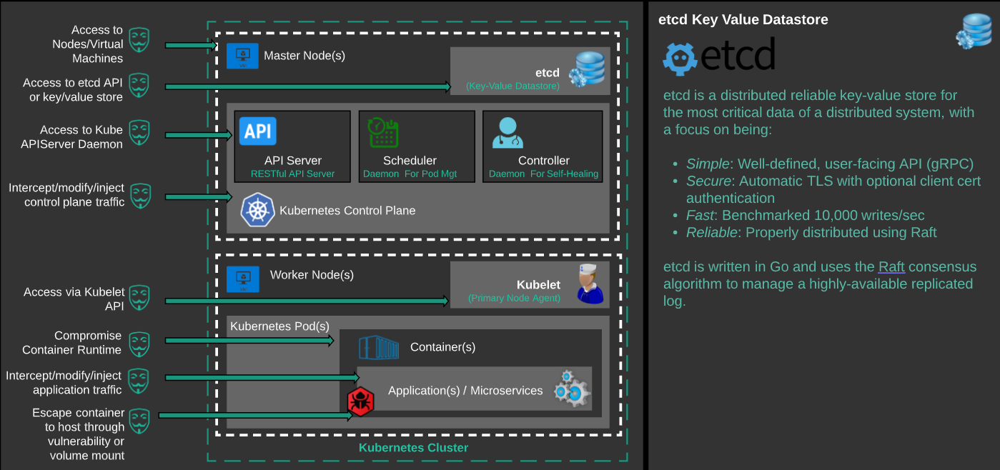
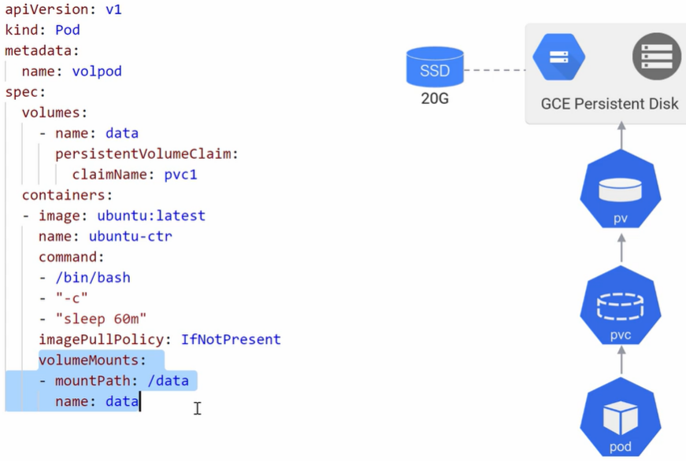
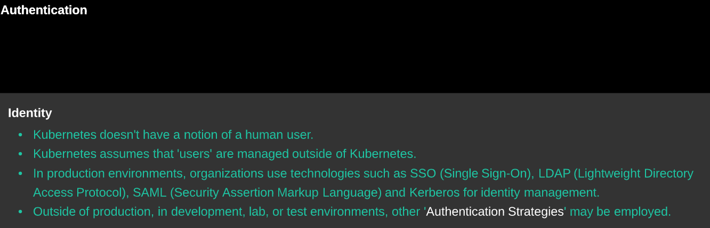
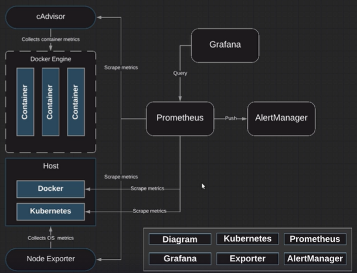
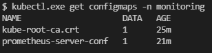

# **Kubernetes**

# **Treinamentos**

Colocar ✔ quando concluído. 

## **Linux Foundation** 

- https://learning.edx.org/course/course-v1:LinuxFoundationX+LFS158x+3T2020/home✔


## **Curso de Introdução ao Kubernetes**

https://docs.google.com/presentation/d/1weqpBWa9FNjKc1ugCUIpwYYquvoIOFbUvEcZ9ZYapAg/edit#slide=id.g23786ddafa_0_68

- Apresentação https://www.youtube.com/watch?v=RuNTvYejG90&feature=youtu.be ✔ 
- 01 - Revisão docker - https://www.youtube.com/watch?v=bcRArpK00OU&feature=youtu.be ✔ 
- 02 - O que é Kubernetes?https://www.youtube.com/watch?v=X2r09kPi8aA&feature=youtu.be ✔ 
- 03 - Arquitetura do K8s - https://www.youtube.com/watch?v=bPFxwwSfSmk&feature=youtu.be ✔ 
- 04 Conceitos importantes do K8s - https://www.youtube.com/watch?v=Y0kHzwifFEA&feature=youtu.be ✔ 
- 05 Instalação dos componentes do K8s - https://www.youtube.com/watch?v=7H61VJV0YI8&feature=youtu.be ✔ 
- 06 Configuração do K8s (53:48) - https://www.youtube.com/watch?v=V1g0alYqI1w&feature=youtu.be ✔ 
- 07 ReplicaSet (7:14) - https://www.youtube.com/watch?v=qfiQyTqzUqU&feature=youtu.be ✔ 
- 08 Deployment (18:52) - https://www.youtube.com/watch?v=2JbQkTF6TzU&feature=youtu.be ✔ 
- 09 Service (27:30) - https://www.youtube.com/watch?v=zGqMvzbWAJc&feature=youtu.be ✔ 
- 10 Microservices (7:48) - https://www.youtube.com/watch?v=SS748X6xvdk&feature=youtu.be ✔ 


## **AcloudGuru**


- ### **Kubernetes Quick Start** ✔
  - https://lucid.app/lucidchart/fc864348-11e5-47fd-a64d-82ba93d32bb3/view?page=c9hx29xGf93-#

- ### **Kubernetes Essentials ✔**
  - https://lucid.app/lucidchart/6d5625be-9ef9-411d-8bea-888de55db5cf/view?page=I_Too4-SqdGV#
  - https://github.com/linuxacademy/robot-shop.

- ### **Introduction to Kubernetes ✔**


- ### **Kubernetes Deep Dive**✔
  - https://github.com/nigelpoulton
  - https://github.com/ACloudGuru-Resources
  - https://github.com/ACloudGuru-Resources/Course_Kubernetes_Deep_Dive_NP

  
  
  
  
- ### **Kubernetes Security**


  - https://github.com/linuxacademy/content-kubernetes-security
    - https://lucid.app/lucidchart/d034d4e7-4f8f-46c2-ad9d-276cde0e0c48/view


  

- ### **Kubernetes Security (Advanced Concepts)**

- ### **Advanced Networking with Kubernetes on AWS**

- ### **Backing up and Restoring Kubernetes Data in etcd**

- ### **Helm Deep Dive V3**

- ### **Certified Kubernetes Administrator (CKA)**

- ### A Practical Guide to Amazon EKS

- ### Learn Kubernetes by Doing

- **Monitoring Kubernetes With Prometheus**

  - https://lucid.app/lucidchart/3da24eca-0c4d-4f03-b202-ba8f455783d2/view?page=0_0#

  - *LAB - Monitoring in Kubernetes with Prometheus and Grafana*

  - *LAB - Kubernetes Monitoring with Prometheus*

  - *LAB - Creating Alerting Rules*

    

- ### **AIOps Essentials (Autoscaling Kubernetes with Prometheus Metrics)**

  - https://interactive.linuxacademy.com/diagrams/AIOpsEssentials.html

- ### **Kubernetes the Hard Way**
  - https://acloudguru-content-attachment-production.s3-accelerate.amazonaws.com/1596643768051-kthw-arch_1532028083.png
  - https://acloudguru-content-attachment-production.s3-accelerate.amazonaws.com/1596643791307-kubernetes-the-hard-way-slides_1536875619.pdf
  - https://github.com/kelseyhightower/kubernetes-the-hard-way


## **Kubernetes 101**

https://www.youtube.com/watch?v=IcslsH7OoYo&list=RDCMUCR-DXc1voovS8nhAvccRZhg&index=2


## **AWS**


- **Amazon Elastic Kubernetes Service (EKS) Primer**✔

  

- ### **Containers on AWS: Ecosystem Integration✔**

  ### **Running Containers on Amazon Elastic Kubernetes Service (Amazon EKS)**✔

- ### **Containers na AWS✔**
  - https://pages.awscloud.com/LATAM_TRAINCERT_WEBINAR_immersion-day-containers-video-series_20200331_7010z000001LIBT_LPVideos-CostOptimizationVideoSeries.html

  

  

- **Leitura**
  - https://github.com/terraform-aws-modules/terraform-aws-eks
  - https://aws.github.io/aws-eks-best-practices/


- ### Amazon EKS on the AWS Cloud Quick Start Reference Deployment
  - https://aws-quickstart.github.io/quickstart-amazon-eks/
  - https://aws-quickstart.github.io/


- ### **Workshops AWS**

  - https://www.eksworkshop.com/

  

- ### **WINDOWS CONTAINERS ON AWS**

  - https://ms-containers.workshop.aws/en/

  

  

- ### **DISASTER RECOVERY ON AWS**

  - https://disaster-recovery.workshop.aws/en/

  

- ### **BLUE/GREEN AND CANARY DEPLOYMENT FOR EKS AND ECS**

  - https://cicd-pipeline-cdk-eks-bluegreen.workshop.aws/en/


- ### **MANAGE YOUR EKS CLUSTER IN FULL-STACK WITH CDK**

  - https://cdk-eks-devops.workshop.aws/en/


- ### **INTRODUCTION TO AMAZON EKS**

  - https://eks-for-aws-summit-online.workshop.aws/


- ### **AMAZON EKS TERRAFORM WORKSHOP**

  - https://tf-eks-workshop.workshop.aws/


- ### **WELCOME TO THE AMAZON EC2 SPOT INSTANCES WORKSHOPS WEBSITE**

  - https://ec2spotworkshops.com/


- ### **AWS MODERNIZATION WORKSHOP**

  - https://aqua.awsworkshop.io/


- ### **APPLICATION MODERNIZATION WITH AWS, SNYK AND DOCKER**

  - https://docker-snyk.awsworkshop.io/


- ### **AWS MODERNIZATION WORKSHOP WITH HARNESS**

  - https://harness.awsworkshop.io/


- ### **Introduction to GitOps on EKS with Weaveworks**

  - https://weaveworks-gitops.awsworkshop.io/


- ### **HELLO** 

  - https://observability.workshop.aws/en/


- ### **AWS MODERNIZATION WORKSHOP: DEVSECOPS WITH ATLASSIAN & SNYK**

  - https://snyk-atlassian.awsworkshop.io/


- ### **Workshop Links**

  - https://workshops.aws/
  - https://awsworkshop.io/


- ### **Agregação de Links**

  - ### https://github.com/brunokktro/auladobruno


## **LinuxTips**

- ### **Descomplicando o Kubernetes** 


https://github.com/badtuxx/DescomplicandoKubernetes

- ### **multi etcd**

- ### Canary Deploy


https://www.youtube.com/watch?v=CTvsdWZrAW0

https://github.com/badtuxx/k8s-canary-deploy-example

- ### **helm**

  

## **Jayendra Patil**

https://jayendrapatil.com/certified-kubernetes-administrator-cka-learning-path/


## **Laboratório K8S**

- **Play with K8s**

https://labs.play-with-k8s.com/

- **Katacoda**

https://www.katacoda.com/courses/kubernetes

- **Tutorials**

https://kubernetes.io/docs/tutorials/

# **Documentação oficial**

https://kubernetes.io/pt-br/docs/home/


## **K8S Teoria**


## **Componentes do K8s**


## **Master Node**

Os componentes da camada de gerenciamento tomam decisões globais sobre o cluster (por exemplo, agendamento de *pods*), bem como detectam e respondem aos eventos do cluster (por exemplo, iniciando um novo *[pod](https://kubernetes.io/docs/concepts/workloads/pods/pod-overview/)* quando o campo `replicas` de um *Deployment* não está atendido).

https://kubernetes.io/docs/concepts/overview/components/


**Sempre no node MASTER**

### **ETCD**

https://kubernetes.io/pt-br/docs/concepts/overview/components/

Armazenamento de valor de chave consistente e altamente disponível usado como armazenamento de apoio do Kubernetes para todos os dados do cluster.



- No **[ETCD](https://kubernetes.io/docs/concepts/overview/components/#etcd)** são armazenados o estado do cluster, rede e outras informações persistentes.
- É Stateful. 
- Se seu cluster Kubernetes usa etcd como armazenamento de apoio, certifique-se de ter um plano de [backup](https://kubernetes.io/docs/tasks/administer-cluster/configure-upgrade-etcd/#backing-up-an-etcd-cluster) para esses dado.

**Comandos**

| Descrição          | Comando                         |
| ------------------ | ------------------------------- |
| Lista pods do etcd | kubectl get pods -n kube-system |
|                    |                                 |
|                    |                                 |


### **API Server**

https://kubernetes.io/docs/concepts/overview/components/#kube-apiserver

**[kube-apiserver](https://kubernetes.io/docs/concepts/overview/components/#kube-apiserver)** é a central de operações do cluster k8s. Todas as chamadas, internas ou externas são tratadas por ele. Ele é o único que conecta no ETCD.


O servidor de API é um componente da [Camada de gerenciamento](https://kubernetes.io/pt-br/docs/reference/glossary/?all=true#term-control-plane) do Kubernetes que expõe a API do Kubernetes. O servidor de API é o *front end* para a camada de gerenciamento do Kubernetes.

O kube-apiserver foi projetado para ser escalonado horizontalmente — ou seja, ele pode ser escalado com a implantação de mais instâncias. Você pode executar várias instâncias do kube-apiserver e balancear (balanceamento de carga, etc) o tráfego entre essas instâncias.

**2.3.2.1 - Comandos**

| Descrição                | Comando                         |
| ------------------------ | ------------------------------- |
| Lista pods do api-server | kubectl get pods -n kube-system |
|                          |                                 |
|                          |                                 |

### **Scheduler**

https://kubernetes.io/pt-br/docs/concepts/overview/components/

**[kube-scheduler](https://kubernetes.io/docs/concepts/overview/components/#kube-apiserver)** usa um algoritmo para verificar em qual node o pod deverá ser hospedado. Ele verifica os recursos disponíveis do node para verificar qual o melhor node para receber aquele pod.


**Comandos**

| Descrição          | Comando                         |
| ------------------ | ------------------------------- |
| Lista pods do etcd | kubectl get pods -n kube-system |
|                    |                                 |
|                    |                                 |

### **Controller**

https://kubernetes.io/pt-br/docs/concepts/overview/components/

**[kube-controller-manager](https://kubernetes.io/docs/concepts/overview/components/#cloud-controller-manager)** é o controle principal que interage com o `kube-apiserver` para determinar o seu estado. Se o estado não bate, o manager irá contactar o controller necessário para checar seu estado desejado. Tem diversos controllers em uso como: os endpoints, namespace e replication.


Componente da camada de gerenciamento que executa os processos de [controlador](https://kubernetes.io/docs/concepts/architecture/controller/).

Logicamente, cada *[controlador](https://kubernetes.io/docs/concepts/architecture/controller/)* está em um processo separado, mas para reduzir a complexidade, eles todos são compilados num único binário e executam em um processo único.

Alguns tipos desses controladores são:

- Controlador de nó: responsável por perceber e responder quando os nós caem.

- Controlador de *Job*: Observa os objetos *Job* que representam tarefas únicas e, em seguida, cria *pods* para executar essas tarefas até a conclusão.

- Controlador de *endpoints*: preenche o objeto *Endpoints* (ou seja, junta os Serviços e os *pods*).

- Controladores de conta de serviço e de *token*: crie contas padrão e *tokens* de acesso de API para novos *namespaces*.


**Comandos**

| Descrição          | Comando                         |
| ------------------ | ------------------------------- |
| Lista pods do etcd | kubectl get pods -n kube-system |
|                    |                                 |
|                    |                                 |

### **Cloud-controller-manager**

Um componente da [camada de gerenciamento](https://kubernetes.io/pt-br/docs/reference/glossary/?all=true#term-control-plane) do Kubernetes que incorpora a lógica de controle específica da nuvem. O gerenciador de controle de nuvem permite que você vincule seu *cluster* na API do seu provedor de nuvem, e separar os componentes que interagem com essa plataforma de nuvem a partir de componentes que apenas interagem com seu cluster.


### **kubeadm**

https://kubernetes.io/docs/reference/setup-tools/kubeadm/

O kubeadm executa as ações necessárias para obter um cluster mínimo viável instalado e funcionando. Por design, ele se preocupa apenas com a inicialização, não com o provisionamento de máquinas. 

**Comandos**

| Descrição                                                    | Comando                                                |
| ------------------------------------------------------------ | ------------------------------------------------------ |
| kubeadm init --pod-network-cidr=10.24.4.0.0/16               | Inicia o cluster setanto o ip do pod-netowork -Flannel |
| kubeadm init --apiserver-advertise-address $(hostname -i)    |                                                        |
|                                                              |                                                        |
|                                                              |                                                        |
| kubeadm init --control-plane-endpoint "k8s-elb-01:6443" --upload-certs | Subir o cluster com elb                                |
| kubeadm token create --print-join-command                    | Restaurar o token do join p/ worker node               |
|                                                              |                                                        |
|                                                              |                                                        |
|                                                              |                                                        |


## **Worker Node**

https://kubernetes.io/pt-br/docs/concepts/overview/components/

https://kubernetes.io/docs/concepts/architecture/nodes/

Os componentes de nó são executados em todos os nós, mantendo os *pods* em execução e fornecendo o ambiente de execução do Kubernetes.	


### **Proxy**

O **kube-proxy** é o responsável por gerenciar a rede para os contêineres, é o responsável por expor portas dos mesmos.

https://kubernetes.io/docs/concepts/overview/components/#kube-proxy

Trata da comunicação entre os Nodes.

- **CBR0 - Cluster Bridge Zero**  
- **IPTABLES Mode** - Antigo
- **IPVS Mode** - Novo


### **Container runtime**

O agente de execução (*runtime*) de contêiner é o software responsável por executar os contêineres.


### **kubelet**

https://kubernetes.io/docs/reference/command-line-tools-reference/kubelet/

O **[kubelet](https://kubernetes.io/docs/concepts/overview/components/#kubelet)** interage com o Docker instalado no node e garante que os contêineres que precisavam estar em execução realmente estão.


- node agent

- instalado em todos os nodes - master e worker
- Conversa com API Server

 

**Comandos**

| Descrição                   | Comando                                                  |
| --------------------------- | -------------------------------------------------------- |
| Lista Nodes                 | kubectl get nodes                                        |
| Describe Node               | kubectl describe node "*node_name*"                      |
| Pegar bloco de ip dos nodes | kubectl get nodes -o jsonpath='{.items[*].spec.podCIDR}' |
|                             |                                                          |

##############################################################################################

## **Demais componentes**

### **POD´s**

https://kubernetes.io/docs/concepts/workloads/pods/

**[Pod](https://kubernetes.io/docs/concepts/workloads/pods/pod-overview/)** é a menor unidade que você irá tratar no k8s. 

- **Você poderá ter mais de um contêiner por Pod**, porém vale lembrar que eles dividirão os mesmos recursos, como por exemplo IP. 
- Uma das boas razões para se ter mais de um contêiner em um Pod é o fato de você ter os logs consolidados.
- O Pod, por poder possuir diversos contêineres, muitas das vezes se assemelha a uma VM, onde você poderia ter diversos serviços rodando compartilhando o mesmo IP e demais recursos.
- Os Pods podem se comunicar sem **NAT**.


**LifeCycle**

https://kubernetes.io/docs/concepts/workloads/pods/pod-lifecycle/

**Entender mais do Lifecycle**

**Anatomia de um Pod ** 

```yaml
apiVersion: v1									-----> Versão da API
kind: Pod									    ----> O que quer criar 
metadata:
  name: examplepod								----> nome do pod
  namespace: pod-example						----> nome da namespace
spec:											---->  espeficicações do container
  volumes:										---->  volumes
  - name: html
    emptyDir: {}
  containers:
  - name: webcontainer							---->  nome do container
    image: nginx								---->  imagem do container
    volumeMounts:
    - name: html
      mountPath: /usr/share/nginx/html
  - name: filecontainer
    image: debian
    volumeMounts:
    - name: html
      mountPath: /html
    command: ["/bin/sh", "-c"]
    args:
      - while true; do
         date >> /html/index.html;
         sleep 1;
        done
```


**Comandos**

| Descrição                                                    | Comando                                     |
| :----------------------------------------------------------- | ------------------------------------------- |
| Editar pod                                                   | kubect edit pod "nomedopod"                 |
| Lista todos os pods de todos as namespaces                   | kubectl get pods --all-namespaces           |
| Lista todos os pods de todos as namespaces  dentro dos worker nodes | kubectl get pods --all-namespaces -o wide   |
| Deleta Pod                                                   | kubectl delete pod "nomepod" -n "namespace" |
| Create Pod                                                   | kubectl create -f pod-exmeple.yaml          |
|                                                              |                                             |
|                                                              |                                             |
|                                                              |                                             |
|                                                              |                                             |


##############################################################################################

### **Namespaces**

https://kubernetes.io/docs/concepts/overview/working-with-objects/namespaces/

Os namespaces fornecem um escopo para nomes. Os nomes dos recursos precisam ser exclusivos em um namespace, mas não entre os namespaces.

Específica com "**-n**", se não especificar nenhuma ele lista da namespace "*default*". 

**Comandos**

| Descrição         | Comandos                                               |
| ----------------- | ------------------------------------------------------ |
| Lista namespaces  | kubectl get namespace / kubectl get ns                 |
| Cria namespaces   | kubectl create namespace "nomedanamespace"             |
| Deleta namespaces | kubectl delete namespaces <insert-some-namespace-name> |
|                   |                                                        |
|                   |                                                        |
|                   |                                                        |
|                   |                                                        |
|                   |                                                        |
|                   |                                                        |


Create a new YAML file called `my-namespace.yaml` with the contents:

```yaml
apiVersion: v1
kind: Namespace
metadata:
  name: <insert-namespace-name-here>
```

Then run:

```
kubectl create -f ./my-namespace.yaml
```


**Setting the namespace for a request**

To set the namespace for a current request, use the `--namespace` flag.

For example:

```shell
kubectl run nginx --image=nginx --namespace=<insert-namespace-name-here>
kubectl get pods --namespace=<insert-namespace-name-here>
```


No POD a namespace é declarada no metadata. 


##############################################################################################

### **Network**

https://kubernetes.io/pt-br/docs/concepts/cluster-administration/networking/


**Container Network Interface**

Para prover a rede para os contêineres, o k8s utiliza a especificação do **CNI**, Container Network Interface.

CNI é uma especificação que reúne algumas bibliotecas para o desenvolvimento de plugins para configuração e gerenciamento de redes para os contêineres. Ele provê uma interface comum entre as diversas soluções de rede para o k8s. Você encontra diversos plugins para AWS, GCP, Cloud Foundry entre outros.

Mais informações em: https://github.com/containernetworking/cni

Enquanto o CNI define a rede dos pods, ele não te ajuda na comunicação entre os pods de diferentes nodes.

As características básicas da rede do k8s são:

- Todos os pods conseguem se comunicar entre eles em diferentes nodes;
- Todos os nodes pode se comunicar com todos os pods;
- **Não utilizar NAT.**

**Todos os IPs dos pods e nodes são roteados sem a utilização de [NAT](https://en.wikipedia.org/wiki/Network_address_translation). **

Isso é solucionado com a utilização de algum software que te ajudará na criação de uma rede Overlay. Seguem alguns:

- [Weave](https://www.weave.works/docs/net/latest/kube-addon/)
- [Flannel](https://github.com/coreos/flannel/blob/master/Documentation/kubernetes.md)
- [Canal](https://github.com/tigera/canal/tree/master/k8s-install)
- [Calico](https://docs.projectcalico.org/latest/introduction/)
- [Romana](http://romana.io/)
- [Nuage](https://github.com/nuagenetworks/nuage-kubernetes/blob/v5.1.1-1/docs/kubernetes-1-installation.rst)
- [Contiv](http://contiv.github.io/)

**Mais utilizados Waeve ou Flannel. **

Mais informações em: https://kubernetes.io/docs/concepts/cluster-administration/addons/


**2.6.5.1 - Comandos**

| Descrição             | Comando                         |
| --------------------- | ------------------------------- |
| Lista pods do coredns | kubectl get pods -n kube-system |
|                       |                                 |
|                       |                                 |

##############################################################################################

### **DNS**

https://kubernetes.io/docs/concepts/services-networking/dns-pod-service/


 Kubelet define esse arquivo para cada pod.

```yaml
root@examplepod:/# cat /etc/resolv.conf
nameserver 10.96.0.10
search pod-example.svc.cluster.local svc.cluster.local cluster.local ec2.internal
options ndots:5

```


### 

##############################################################################################

**2.6.5 - Replicas e Replicas Set**

https://kubernetes.io/docs/concepts/workloads/controllers/replicaset/

O objetivo de um **ReplicaSet** é manter um conjunto estável de pods de réplica em execução a qualquer momento. Como tal, costuma ser usado para garantir a disponibilidade de um número especificado de pods idênticos

**Anatomia de um replica set.** 


Detalhamento do arquivo yaml

```yaml
apiVersion: apps/v1
kind: ReplicaSet
metadata:
  name: frontend
  labels:
    app: nginx
    tier: frontend
spec:
  replicas: 2  											--->> Numero de replicas
  selector:
    matchLabels: 
      tier: frontend
    matchExpressions:
      - {key: tier, operator: In, values: [frontend]}
  template:
    metadata:
      labels:
        app: nginx
        tier: frontend
    spec:
      containers:
      - name: nginx
        image: darealmc/nginx-k8s:v1
        ports:
        - containerPort: 80
```

Para verificar se uma replica set controla o pod:

descbribe no pod

verifique a saida: Controlled By


**2.3.5.1 - Comandos**


| Descrição               | Comando                                                      |
| ----------------------- | ------------------------------------------------------------ |
| Describe na replica set | kubectl describe rs/"nomedareplica"                          |
| Escala replicas         | kubectl scale rs/"nomedareplica"--replicas="numero de replicas" |
| Deleta replica set      | kubectl delete rs/"nomedareplica"                            |
|                         | kubectl get rs/"nomedareplica"                               |
|                         |                                                              |
|                         |                                                              |
|                         |                                                              |
|                         |                                                              |
|                         |                                                              |


##############################################################################################

### **Services**

https://kubernetes.io/docs/concepts/services-networking/service/

Uma maneira abstrata de expor um aplicativo em execução em um conjunto de [Pods](https://kubernetes.io/docs/concepts/workloads/pods/) como um serviço de rede.


Com o Kubernetes, você não precisa modificar seu aplicativo para usar um mecanismo de descoberta de serviço desconhecido. O Kubernetes fornece aos pods seus próprios endereços IP e um único nome DNS para um conjunto de pods e pode fazer o balanceamento de carga entre eles. 

É uma forma de você expor a comunicação através de um **NodePort** ou **LoadBalancer** para distribuir as requisições entre diversos Pods daquele Deployment. Funciona como um balanceador de carga.

**Tipos de Services:**

- **NodePort:** Sempre acessível de **DENTRO** do Cluster - Por Porta
- **ClusterIP:** Sempre acessível de **FORA** do Cluster - Por IP
- **LoadBalancer:** Integração com Cloud Publica


**O IP e o nome do Service nunca muda.** 


O vinculo entre o Service e o Pod é feito pelo label informado no Selector conforme abaixo:


Ele cria um IP virtual para os pods, mas o endpoint continua sendo o ip dos pods. 


**Anatomia do Service**

```yaml
apiVersion: v1
kind: Service
metadata:
  labels:
    run: nginx
  name: nginx-clusterip
  namespace: default
spec:
  externalTrafficPolicy: Cluster
  ports:
  - port: 80
    protocol: TCP
    targetPort: 80
  selector:					----> determina quais pod´s farão parte do service
    run: nginx				----> determina quais pod´s farão parte do service
    sessionAffinity: None
  type: ClusterIP
```


**Comandos**

| Descrição         | Comandos                               |
| ----------------- | -------------------------------------- |
| Lista Services    | kubectl get services / kubectl get svc |
| Describe Services | kubectl describe svc "*service-name*"  |
|                   |                                        |
|                   |                                        |
|                   |                                        |
|                   |                                        |
|                   |                                        |
|                   |                                        |
|                   |                                        |

##############################################################################################

### **Deployment**

https://kubernetes.io/docs/concepts/workloads/controllers/deployment/


Você descreve um *estado desejado* em uma implantação, e a implantação [Controlador](https://kubernetes.io/docs/concepts/architecture/controller/) altera o estado real para o estado desejado em uma taxa controlada. Você pode definir implantações para criar novos **ReplicaSets** ou remover implantações existentes e adotar todos os seus recursos com novas implantações.

O deployment é uma ótima maneira de automatizar o gerenciamento de seus pods. O deployment permite que você especifique um estado desejado para um conjunto de pods. O cluster trabalhará constantemente para manter o estado desejado.

- **Scaling** - Entender mais
- **Rolling updates** - Entender mais
- **Self-Healing** - Entender mais


```yaml
apiVersion: apps/v1
kind: Deployment
metadata:
  labels:
    run: prod-redis						--> Labels
  name: prod-redis
spec:
  selector:
    matchLabels:
      run: prod-redis
  replicas: 3							---> ReplicaSet
  minReadySeconds: 300					---> Tempo para chegar o pod como health
  strategy:								--> Estratégia de replicas
    rollingUpdate:
      maxSurge: 1						--> Vai criar uma nova réplica e deletar 1 / Pode ser qde ou %
      maxUnavailable: 0
    type: RollingUpdate
  template:
    metadata:
      labels:
        run: prod-redis						--> Labels
    spec:
      containers:
      - image: redis:4.0
        name: redis
```


Stateful Sets

StatefulSet é o objeto da API de carga de trabalho usado para gerenciar aplicações stateful. 

Como uma implantação, um StatefulSet gerencia pods com base em uma especificação de contêiner idêntica. 

Ao contrário de uma implantação, um StatefulSet mantém uma identidade persistente para cada um de seus pods. 

Esses pods são criados com a mesma especificação, mas não são intercambiáveis: cada um tem um identificador persistente, mantido em qualquer reagendamento.

Daemon Sets

Um DaemonSet garante que os nodes executem uma cópia de um pod. **À medida que os nodes são adicionados ao cluster, os pods são adicionados a eles.** 

Porém, sempre que os nodes forem removidos do cluster, esses pods são coletados como lixo. A exclusão de um DaemonSet limpará os pods criados.

Entre os diversos usos de um DaemonSet, podemos citar: 

- Daemon de armazenamento em cluster em cada node, como glusterd e ceph, por exemplo. 
- Daemon de coleta de logs em todos os nodes, como fluentd ou filebeat.
- Daemon de monitoramento de node em cada node, como Prometheus Node Exporter, Flowmill, Sysdig Agent, collectd, Dynatrace OneAgent, AppDynamics Agent, entre outros. 

Em um caso simples, um DaemonSet, cobrindo todos os nodes, seria usado para cada tipo de daemon. 

Uma configuração mais complexa pode usar vários DaemonSets para um único tipo de daemon. 

No entanto, com diferentes sinalizadores e/ou diferentes solicitações de memória e CPU para cada tipo de hardware.

**Anotações Importantes**

- **Um tipo Pod por deployment, mas pode ter varias replicar desse pod (replicas set)**
- **Sempre cria uma nova replica set quando vai fazer o rollout**
- **Sempre utilizar a flag "--record" no apply para criar o history do rollout**

**Comandos**

| Descrição                          | Comando                                                      |
| ---------------------------------- | ------------------------------------------------------------ |
| Altera imagem no deploy            | kubectl set image deployment.v1.apps/"*nome-deployment*" nginx="image" |
| Para acompanhar as atualizações    | kubectl describe deploy "*nome-deployment*"                  |
| Cria deployment básico             | kubectl create deployment "*nome-deployment*" --image=nginx  |
| Escala deployment                  | kubectl scale deployment "*nome-deployment*" --replicas="*qde-replicas*" |
| Opção DryRun não Cria o Deployment | kubectl create deployment meu-nginx --image=nginx **--dry-run=client** -o yaml > deployment-template.yaml |
| Acompanha o rollout da app         | kubectl rollout status deploy "*nome-do-deploy*"             |
| History dos rolouts                | kubectl.exe rollout history deploy test                      |
| Ver alterações na revisão          | kubectl.exe rollout history deploy test --revision=3         |
| Volta na versão tageada            | kubectl.exe rollout undo deploy test                         |
|                                    |                                                              |
|                                    |                                                              |


### 

##############################################################################################

### **Endpoints**

**Sempre pega com o Endpoint os pods que estão no Selector.**

O vinculo entre o Service e o Pod é feito pelo label informado no Selector conforme abaixo:


##############################################################################################

### **Storage**

Os volumes são um diretório que contém dados acessíveis aos contêineres em um pod. Um volume Kubernetes tem a mesma vida útil que o pod que o encapsula. 

Ele sobrevive a todos os contêineres executados no pod e os dados são preservados quando um contêiner é reiniciado.

O Kubernetes suporta muitos tipos de volumes e um pod pode usar todos eles simultaneamente.

https://kubernetes.io/docs/concepts/storage/


**Volumes**

https://kubernetes.io/docs/concepts/storage/volumes/

**Container Storage Interface (CSI)**

https://kubernetes.io/blog/2019/01/15/container-storage-interface-ga/


**Persistent Volumes**

https://kubernetes.io/docs/concepts/storage/persistent-volumes/


**EmptyDir** 

Um volume do tipo **EmptyDir** é criado sempre que um Pod é atribuído a um nó existente. Esse volume é criado inicialmente vazio, e todos os contêineres do Pod podem ler e gravar arquivos no volume.

Esse volume não é um volume com persistência de dados. Sempre que o Pod é removido de um nó, os dados no `EmptyDir` são excluídos permanentemente. É importante ressaltar que os dados não são excluídos em casos de falhas nos contêineres.

Disco disponível somente enquando o pod estiver rodando.

Recomendado para logs por exemplo.

Disco no Node em /var/lib/kubelet/pods , find . -iname "*nomedodisco*"


**Persistent Volume**

O subsistema **PersistentVolume** fornece uma API para usuários e administradores que resume detalhes de como o armazenamento é fornecido e consumido pelos Pods. Para o melhor controle desse sistema foi introduzido dois recursos de API: `PersistentVolume` e `PersistentVolumeClaim`.

Um **PersistentVolume** (PV) é um recurso no cluster, assim como um nó. Mas nesse caso é um recurso de armazenamento. O PV é uma parte do armazenamento no cluster que foi provisionado por um administrador. Os PVs tem um ciclo de vida independente de qualquer pod associado a ele. Essa API permite armazenamentos do tipo: NFS, ISCSI ou armazenamento de um provedor de nuvem específico.

Um **PersistentVolumeClaim** (PVC) é semelhante a um Pod. Os Pods consomem recursos de um nó e os PVCs consomem recursos dos PVs.

Mas o que é um PVC? Nada mais é do que uma solicitação de armazenamento criada por um usuário.

Vamos criar um `PersistentVolume` do tipo `NFS`, para isso vamos instalar os pacotes necessários para criar um NFS Server no GNU/Linux.

Sequencia: Cria o **PV** depois o **PVC**.


**PV** é criado no WorkerNode.

**PVC** é o que aponta no POD.

**Reclaim Policy no PV**

- Retain
- Detele





**Storage Classes**

Um StorageClass fornece uma maneira para os administradores descreverem as "classes" de armazenamento que oferecem.

https://kubernetes.io/docs/concepts/storage/storage-classes/


**Comandos**


| Descrição             | Comando                      |
| --------------------- | ---------------------------- |
| Listar o StorageClass | kubect get sc                |
|                       | kubectl describe sc "nomesc" |
|                       |                              |
|                       |                              |
|                       |                              |

##############################################################################################


### **Scaling**

#### **Horizontal Pod Autoscaler - HPA**

https://kubernetes.io/docs/tasks/run-application/horizontal-pod-autoscale/

O autoescalador horizontal de pods dimensiona automaticamente o número de pods em um controlador de replicação, implantação, conjunto de réplicas ou conjunto com estado com base na utilização de CPU observada (ou, com suporte a [métricas personalizadas](https://git.k8s.io/community/contributors/design-proposals/instrumentation/custom-metrics-api.md) , em algumas outras métricas fornecidas pelo aplicativo).


**ENTENDER MAIS SOBRE O CALCULO DE CPU**


#### **Vertical Pod Autoscaler - VPA**

Em Alpha 

#### **Cluster Autoscaler - CA**

**Para Nodes**


#### **Anotações Importantes**

- **Um HPA por Deployment**
- **autoscaling/v2 tem custom metrics/cpu/memory**
- **No Cluster Autoscaler sempre utilizar Pod Resource Requests**
- **No Cluster Autoscaler  não mexa com os pools de nós**
- **No Cluster Autoscaler  verifique sua nuvem para suporte** (--enable-autoscaling)
- **No Cluster Autoscaler teste o desempenho em grandes clusters**

#### **Comandos**

| Descrição            | Comando         |
| -------------------- | --------------- |
| Listas todos os hpas | kubectl get hpa |
|                      |                 |
|                      |                 |
|                      |                 |
|                      |                 |

##############################################################################################

### **Labels**

https://kubernetes.io/docs/concepts/overview/working-with-objects/labels/

Labels permitem que os usuários mapeiem suas próprias estruturas organizacionais em objetos do sistema de maneira fracamente acoplada, sem exigir que os clientes armazenem esses mapeamentos.

Uso para filtros 

É um par chave-valor

Pode-se usar até 3.

## 

O **Node Selector** é uma forma de classificar nossos nodes como por exemplo nosso node `elliot-02` que possui disco **SSD** e está localizado no DataCenter `UK`, e o node `elliot-03` que possui disco **HDD** e está localizado no DataCenter `Netherlands`.

Para criar pods em nodes com o Label "disk""HDD", adiciona no deployment  no spec do pod a opção abaixo.

```yaml
 nodeSelector:
              disk: HDD
```


**Labels recomentados**

https://kubernetes.io/docs/concepts/overview/working-with-objects/common-labels/

#### **Comandos**


| Descrição                               | Comando                                                      |
| --------------------------------------- | ------------------------------------------------------------ |
| Listas todos os pods com Label          | kubectl get pods --show-labels                               |
| Listar os pods com o Label especificado | kubectl get pods -l dc="label"                               |
| Lista os pods com o label "DC"          | kubectl get pods -L "label"                                  |
| Setar Label no pod                      | kubectl label pod "nomedopod" "label"="valor" -n "namespace" |
| Deletar pod com Label especifico        | kubectl delete pod -l "label"="valor" -n "namespace"         |
|                                         |                                                              |
|                                         |                                                              |
|                                         |                                                              |
|                                         |                                                              |


##############################################################################################


##############################################################################################

### **[Supervisord](http://supervisord.org/)** 

é o responsável por monitorar e restabelecer, se necessário, o `kubelet` e o Docker. Por esse motivo, quando existe algum problema em relação ao kubelet, como por exemplo o uso do driver `cgroup` diferente do que está rodando no Docker, você perceberá que ele ficará tentando subir o kubelet frequentemente.

##############################################################################################

### **Kubectl Taint**

O **Taint** nada mais é do que adicionar propriedades ao nó do cluster para impedir que os pods sejam alocados em nós inapropriados.

Por exemplo, todo nó `master` do cluster é marcado para não receber pods que não sejam de gerenciamento do cluster.

O nó `master` está marcado com o taint `NoSchedule`, assim o scheduler do Kubernetes não aloca pods no nó master, e procurar outros nós no cluster sem essa marca.

```yaml
## NoSchedule - Novos containers não são executados no node
**Habilitado** - kubectl taint node k8s-worker-01 key1=value1:NoSchedule
**Desabilitado** - kubectl taint node k8s-worker-01 key1=value1:NoSchedule-

## NoExecute - Não executa containers no node, ele mata e migra para outro node
**Habilitado** - kubectl taint node elliot-03 key1=value1:NoExecute
**Desabilitado** - kubectl taint node elliot-03 key1=value1:NoExecute-
```

##############################################################################################

### **Context**

##############################################################################################

### **Alias**

alias kk=kubectl

##############################################################################################

### **--dry-run** 

-o yaml

##############################################################################################

# **Setup WEB UI**

https://acloudguru-content-attachment-production.s3-accelerate.amazonaws.com/1596555315055-302-kubernetessecuritydashboardsetup_1558387085.pdf

kubectl.exe apply -f https://raw.githubusercontent.com/kubernetes/dashboard/v2.0.0-beta4/aio/deploy/recommended.yaml

https://docs.aws.amazon.com/pt_br/eks/latest/userguide/dashboard-tutorial.html

**Get Token**

kubectl -n kubernetes-dashboard describe secret $(kubectl -n kubernetes-dashboard get secret | grep admin-user | awk '{print $1}')


**Acesso**

http://localhost:8001/api/v1/namespaces/kubernetes-dashboard/services/https:kubernetes-dashboard:/proxy/#!/login

##############################################################################################

# **Security**

https://kubernetes.io/docs/tasks/administer-cluster/securing-a-cluster/

https://cheatsheetseries.owasp.org/cheatsheets/Kubernetes_Security_Cheat_Sheet.html


## **3 A´s - Authentication - Authorization - Admission**


### **Authorization(authZ)**

https://kubernetes.io/docs/reference/access-authn-authz/authorization/

- **Liberações do usuários**
- **Role | ClusterRole**


- **RoleBinding |ClusterRoleBinding**


**RBAC**

https://kubernetes.io/docs/reference/access-authn-authz/rbac/

O controle de acesso baseado em função (RBAC) é um método de regular o acesso a recursos de computador ou rede com base nas funções de usuários individuais em sua organização.


### **Authentication(authN)**

https://kubernetes.io/pt-br/docs/reference/access-authn-authz/authentication/

- **Proveder ID**
- **Token**



https://kubernetes.io/pt-br/docs/reference/access-authn-authz/authentication/#estrat%C3%A9gias-de-autentica%C3%A7%C3%A3o


https://kubernetes.io/pt-br/docs/reference/access-authn-authz/authentication/#certificados-de-cliente-x509


https://kubernetes.io/pt-br/docs/reference/access-authn-authz/authentication/#arquivo-est%C3%A1tico-de-token


***Não Recomendado*** 


https://kubernetes.io/pt-br/docs/reference/access-authn-authz/authentication/#tokens-de-contas-de-servi%C3%A7o


https://kubernetes.io/docs/reference/access-authn-authz/rbac/


O controle de acesso baseado em função (RBAC) é um método de regular o acesso a recursos de computador ou rede com base nas funções de usuários individuais em sua organização.


### **Admission Control**

https://kubernetes.io/docs/reference/access-authn-authz/admission-controllers/

Admission Control é um trecho de código que intercepta solicitações para o servidor da API Kubernetes antes da persistência do objeto, mas depois que a solicitação é autenticada e autorizada. 


https://kubernetes.io/docs/reference/access-authn-authz/admission-controllers/#is-there-a-recommended-set-of-admission-controllers-to-use


- **Mutatung**

- **Validating**

  

### **Anotações Importantes**

- *Alguns clusters abrem uma porta local insegura, desabilite em Produção;*
- *Deny-by-default;*
- *Kubernetes NÃO faz usuários;*
- *Gerencie os usuários externamente;*

### **Comandos**


| Descrição                             | Comando                                              |
| ------------------------------------- | ---------------------------------------------------- |
| Listar as ClusterRoleBindings         | kubectl.exe get clusterrolebindings                  |
| Listar as ClusterRole                 | kubectl.exe get clusterrole                          |
| Listar as Role de todas as namespaces | kubectl.exe get role --all-namespaces                |
| Listar as Role de namespaces          | kubectl.exe get role -n "*namespaces*"               |
| Lista uma role especifica             | kubectl.exe get clusterrole "*nome-da-role*"         |
| Lista uma role especifica em YAML     | kubectl.exe get clusterrole "*nome-da-role*" -o yaml |
| Descrição da ClusterRole              | kubectl.exe describe clusterrole "*nome-da-role*"    |
|                                       |                                                      |
|                                       |                                                      |


## **Tipos de Ataques**

### **Attack Vectors**


### **Access to etcd**


### **Access Kubernetes API Server**


### **Intercept/Modify/Inject Control Plane**


### **Access via Kubelet API**


### **Compromise Container Runtime**


### **Intercept/Modify/Inject Application Traffic**


### **Escape Container Host**


### **Vulnarebilities**


## **Principle of Least Privilege**


O princípio significa dar a uma [conta de usuário](https://en.wikipedia.org/wiki/User_account) ou processo apenas os privilégios que são essenciais para executar sua função pretendida. Por exemplo, uma conta de usuário com o único propósito de criar backups não precisa instalar software: portanto, ela tem direitos apenas para executar backup e aplicativos relacionados a backup.

https://en.wikipedia.org/wiki/Principle_of_least_privilege#cite_note-1

- Utilizar namespaces;
- Serviceaccounts;
- Roles

## **Boundaries**


### **Cluster**


### **Node**


### **Namespaces**


### **Pod**


### **Container**


## **TLS**


### **API Server**


### **ETCD**


### **Scheduler**


### **Controller**


### **Services**


## **Firewall and Virtual Private Networking**


https://v1-17.docs.kubernetes.io/docs/tasks/access-application-cluster/configure-cloud-provider-firewall/

### **Load Balancers**


## **Using kube-bench toHarden a Cluster**


https://github.com/aquasecurity/kube-bench

**Setup**

```shell
$ kubectl apply -f job.yaml
job.batch/kube-bench created

$ kubectl get pods
NAME                      READY   STATUS              RESTARTS   AGE
kube-bench-j76s9   0/1     ContainerCreating   0          3s

# Wait for a few seconds for the job to complete
$ kubectl get pods
NAME                      READY   STATUS      RESTARTS   AGE
kube-bench-j76s9   0/1     Completed   0          11s

# The results are held in the pod's logs
kubectl logs kube-bench-j76s9
[INFO] 1 Master Node Security Configuration
[INFO] 1.1 API Server
```


## **Securing the Kubelet**

https://kubernetes.io/docs/reference/command-line-tools-reference/kubelet/


https://kubernetes.io/docs/setup/production-environment/tools/kubeadm/kubelet-integration/

https://kubernetes.io/docs/tasks/administer-cluster/reconfigure-kubelet/

## **Securing ETCD**


## **Melhores Práticas**

https://kubernetes.io/docs/tasks/administer-cluster/securing-a-cluster/


##############################################################################################

# **Monitoring**

**TODO - Mudar o setup do monitoramento para Helm.**

https://docs.aws.amazon.com/pt_br/eks/latest/userguide/prometheus.html

https://www.eksworkshop.com/intermediate/240_monitoring/deploy-prometheus/

https://github.com/aws/eks-charts




## **Prometheus**

https://prometheus.io/


### **Client Libraries**

https://prometheus.io/docs/instrumenting/clientlibs/

Antes de monitorar seus serviços, você precisa adicionar instrumentação ao código por meio de uma das bibliotecas cliente do Prometheus.

Quando o Prometheus raspa o endpoint HTTP da sua instância, a biblioteca cliente envia o estado atual de todas as métricas rastreadas para o servidor.


### **Exports**

https://prometheus.io/docs/instrumenting/exporters/

Existem várias bibliotecas e servidores que ajudam a exportar métricas existentes de sistemas de terceiros como métricas do Prometheus.


### **Service Discovery**

https://prometheus.io/blog/2015/06/01/advanced-service-discovery/


### **Scraping**


### **Setup Prometheus**

https://github.com/linuxacademy/content-kubernetes-prometheus-env


**Setup namespace**

```bash
kubectl apply -f namespaces.yml
```

Verificar se o recurso foi criado da corretamente.

```bash
kubectl get ns
```


**Setup Config MAP**

Tem que alterar no job node-exporter os ips dos targets para os ips do master e dos nodes.

```bash
kubectl apply -f prometheus-config-map.yml
```

Verificar se o recurso foi criado da corretamente.

```bash
kubectl.exe get configmaps -n monitoring
```



**Setup Deployment**

Cria 2 containeres - Prometheus e Watch

```bash
kubectl apply -f prometheus-deployment.yml
```

Verificar se o recurso foi criado da corretamente.

```bash
kubectl.exe get deploy -n monitoring
```


**Setup Prometheus Service** 

```bash
kubectl.exe apply -f prometheus-service.yml 
```

Verificar se o recurso foi criado da corretamente.

```bash
kubectl.exe get svc -n monitoring
```


**Setup ClusterRole**

```bash
kubectl.exe apply -f clusterRole.yml 
```


**Setup kube-state-metric**

https://github.com/kubernetes/kube-state-metrics

```bash
kubectl.exe apply -f kube-state-metrics.yml
```


## **Grafana**


### **Setup Grafana**

**Deployment**

```bash
kubectl.exe apply -f grafana-deployment.yml
```

Verificar se o recurso foi criado da corretamente.

```bash
kubectl.exe get deploy -n monitoring
```


**Service**

```bash
kubectl.exe apply -f grafana-service.yml
```

Verificar se o recurso foi criado da corretamente.

```bash
kubectl.exe get svc -n monitoring
```


## **Node Exporter**

https://prometheus.io/docs/guides/node-exporter/


**Avaliar** 

Fazer o do Linux tips

https://www.metricfire.com/blog/how-to-deploy-prometheus-on-kubernetes/#Deployment

https://devopscube.com/setup-prometheus-monitoring-on-kubernetes/

##############################################################################################

# **Setup do Kubernetes**

**Configura modulos**

// - Resolve problema de versão

https://stackoverflow.com/questions/49721708/how-to-install-specific-version-of-kubernetes

Crie o arquivo `/etc/modules-load.d/k8s.conf` com o seguinte conteúdo em todos os seus nós.

```bash
sudo echo "br_netfilter" > /etc/modules-load.d/k8s.conf
sudo echo "ip_vs" >> /etc/modules-load.d/k8s.conf
sudo echo "ip_vs_rr" >> /etc/modules-load.d/k8s.conf
sudo echo "ip_vs_sh" >> /etc/modules-load.d/k8s.conf
sudo echo "ip_vs_wrr" >> /etc/modules-load.d/k8s.conf
sudo echo "nf_conntrack_ipv4" >> /etc/modules-load.d/k8s.conf
```

Atualiza distro

```bash
apt-get update && apt-get upgrade -y
```

**Instala Docker**

```bash
sudo curl -fsSL https://get.docker.com | bash
```

**Configura Cgroup**

```bash

# cat > /etc/docker/daemon.json <<EOF
{
  "exec-opts": ["native.cgroupdriver=systemd"],
  "log-driver": "json-file",
  "log-opts": {
    "max-size": "100m"
  },
  "storage-driver": "overlay2"
}
EOF

sudo mkdir -p /etc/systemd/system/docker.service.d

sudo systemctl daemon-reload

sudo systemctl restart docker

docker info | grep -i cgroup
```

Se a saída foi `Cgroup Driver: systemd`, tudo certo!

**Configura Repo K8S**

```bash
sudo apt-get update && apt-get install -y apt-transport-https gnupg2

sudo curl -s https://packages.cloud.google.com/apt/doc/apt-key.gpg | apt-key add -

sudo echo "deb http://apt.kubernetes.io/ kubernetes-xenial main" > /etc/apt/sources.list.d/kubernetes.list

sudo apt-get update
```

**Instala pacotes K8S**

```bash
sudo apt-get install -y kubelet kubeadm kubectl
```

**Baixa imagens K8S**

```bash
sudo kubeadm config images pull
```

 **Desabilita Swap**

```bash
swapoff -a
```

**Inicia o Master Node**

```shell
kubeadm init --apiserver-advertise-address $(hostname -i)
```

**Seta saída do kubeadm**

```shell
sudo cp /etc/kubernetes/admin.conf $HOME/
sudo chown $(id -u):$(id -g) $HOME/admin.conf
export KUBECONFIG=$HOME/admin.conf
```

3 - Configura plugin rede

```shell
kubectl apply -f "https://cloud.weave.works/k8s/net?k8s-version=$(kubectl version \|base64 \|tr -d '\n')"
```

4 - Join dos nodes

```bash
kubeadm join --discovery-token-unsafe-skip-ca-verification --token=102952.1a7dd4cc8d1f4cc5 172.17.0.69:6443
```

##############################################################################################

# **Best  Practices**

- **ETCD** - em produção sempre manter fora do Master e em HA


##############################################################################################


# **Exemplos**

**service-clusterip.yaml**

```yaml
apiVersion: v1
kind: Service
metadata:
  labels:
    run: nginx
  name: nginx-clusterip
  namespace: default
spec:
  externalTrafficPolicy: Cluster
  ports:
  - port: 80
    protocol: TCP
    targetPort: 80
  selector:
    run: nginx
  sessionAffinity: None
  type: ClusterIP
```

**service-nodeip.yaml**

```yaml
apiVersion: v1
kind: Service
metadata:
  labels:
    run: nginx
  name: nginx-nodeport
  namespace: default
spec:
  externalTrafficPolicy: Cluster
  ports:
  - nodePort: 32548
    port: 80
    protocol: TCP
    targetPort: 80
  selector:
    run: nginx
  sessionAffinity: ClientIP
  type: NodePort
```


**service-loadbalancer.yaml**

```yaml
apiVersion: v1
kind: Service
metadata:
  labels:
    run: nginx
  name: nginx-loadbalancer
  namespace: default
spec:
  externalTrafficPolicy: Cluster
  ports:
  - nodePort: 32548
    port: 80
    protocol: TCP
    targetPort: 80
  selector:
    run: nginx
  sessionAffinity: None
  type: LoadBalancer
```


**deployment-limitado.yaml** 

```yaml
apiVersion: extensions/v1beta1
kind: Deployment
metadata:
  labels:
    run: nginx
  name: nginx-limitado
  namespace: default
spec:
  progressDeadlineSeconds: 600
  replicas: 1
  revisionHistoryLimit: 2
  selector:
    matchLabels:
      run: nginx
  strategy:
    rollingUpdate:
      maxSurge: 25%
      maxUnavailable: 25%
    type: RollingUpdate
  template:
    metadata:
      creationTimestamp: null
      labels:
        run: nginx
    spec:
      containers:
      - image: nginx
        imagePullPolicy: Always
        name: nginx
        ports:
        - containerPort: 80
          protocol: TCP
        resources:
          limits:  ## Quando o K8S vai liberar para esse deployment
            memory: 128Mi
            cpu: 1
          requests: ## Minimo garantido que o K8S vai liberar para esse deployment
            memory: 96Mi
            cpu: 1
        terminationMessagePath: /dev/termination-log
        terminationMessagePolicy: File
      dnsPolicy: ClusterFirst
      restartPolicy: Always
      schedulerName: default-scheduler
      securityContext: {}
      terminationGracePeriodSeconds: 30
```

```yaml
Atenção! 1 core de CPU corresponde a 1000m (1000 milicore). Ao especificar 200m, estamos querendo reservar 20% de 1 core da CPU. Se fosse informado o valor 0.2 teria o mesmo efeito, ou seja, seria reservado 20% de 1 core da CPU.
```

##############################################################################################

# **Comandos **


https://kubernetes.io/docs/reference/kubectl/overview/

A figura a seguir mostra a estrutura dos principais comandos do `kubectl`.


|                           Comando                            | Descrição                                                    |
| :----------------------------------------------------------: | :----------------------------------------------------------- |
|                                                              |                                                              |
|                      kubectl get events                      | Lista os eventos                                             |
|                 kubectl get componentstatus                  | Status dos componentes                                       |
|                     kubectl cluster-info                     | Informações do cluster                                       |
|                  kubectl cluster-info dump                   | Gerar Dump das infos do cluster                              |
|               kubectl run nginx --image=nginx                | Cria um POD                                                  |
|              kubectl get pods nginx **-o yaml**              | mostra o manifesto do pod                                    |
| kubectl run meu-nginx --image nginx **--dry-run=client** -o yaml > pod-template.yaml | Opção DryRun não Cria o POD                                  |
|                                                              |                                                              |
|                  kubectl explain "recurso"                   | Explica o recurso "main page"                                |
|                        kubectl expose                        | Cria Services                                                |
|                    kubectl logs -f nginx                     | Analise de Logs                                              |
|                   kubectl version -o yaml                    | Versão do Kubernetes                                         |
|                                                              |                                                              |
|  echo "source <(kubectl completion bash)" >> /root/.bashrc   | auto complete                                                |
|                                                              |                                                              |
|      kubectl get pods "nomedopod" -o yaml > meupod.yaml      | Cria um arquivo yaml com as infos do pod                     |
| kubectl get pods "nomedopod" -o yaml --export > meupod.yaml  | Cria um arquivo yaml com as infos do pod, mas sem infos especificas |
|                      kubeadm token list                      | Lista Tokens                                                 |
| aws eks --region "*region*" update-kubeconfig --name "*cluster-name*" | Conecta no cluster EKS                                       |
|                                                              |                                                              |
|                                                              |                                                              |
|                                                              |                                                              |
|                                                              |                                                              |
|                                                              |                                                              |
|                                                              |                                                              |
|                                                              |                                                              |
|                                                              |                                                              |
|                                                              |                                                              |

##############################################################################################

# **Links Úteis**

**Tipos de topologias de K8s multi-master**

https://kubernetes.io/docs/setup/production-environment/tools/kubeadm/ha-topology/


**Instalação kubeadm, kubelet e kubectl**

https://kubernetes.io/docs/setup/production-environment/tools/kubeadm/install-kubeadm/


**Instalação Kubernetes multi-master**

https://kubernetes.io/docs/setup/production-environment/tools/kubeadm/high-availability/


**HAproxy**

https://www.haproxy.org/


**Options for Highly Available topology**

https://kubernetes.io/docs/setup/production-environment/tools/kubeadm/ha-topology/


**Creating Highly Available clusters with kubeadm**

https://kubernetes.io/docs/setup/production-environment/tools/kubeadm/high-availability/
